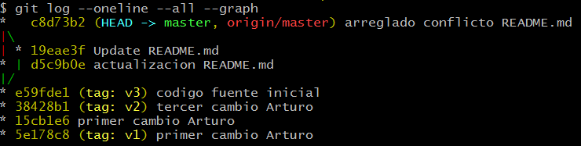
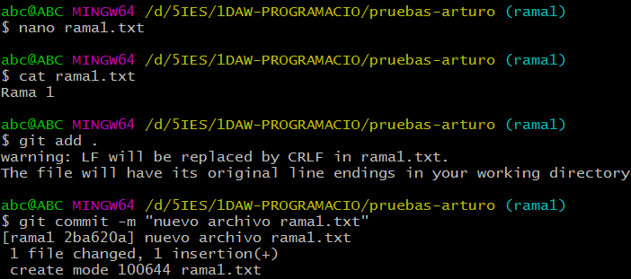
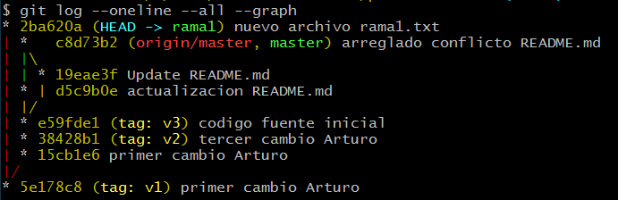

[toc]
# Áreas de un repositorio GIT

En esta actividad deberás buscar información y explicar las 3 áreas de un proyecto Git:

- **Directorio de trabajo (*Working director*y)**
- **Área de preparación (*Staging area*)**
- **Repositorio (*Directorio .git*)**


# Configurar nuestro git

> *################################################################*
>
> **Subir a la plataforma *<u>AULES</u>* un documento PDF de nombre <u>*tarea01tunombre*</u> con las capturas de pantalla y explicaciones pertinentes.**
>
> *################################################################*

Antes de comenzar a utilizar git, debemos configurarlo con los valores que tendrá a partir de ahora (*nombre, correo electrónico, ...*).

Para ello, establecemos:

- el **nombre** de usuario:

  ````
  git config --global user.name "tu_nombre_completo"
  ````

- el **correo** de usuario:

  ````
  git config --global user.email "tu_direccion_de_correo_electronico"
  ````

- el **coloreado** de la salida:

  ````
  git config --global colori.ui auto
  ````

- el **estado original en los conflictos**:

  ````
  git config --global merge.conflictstyle diff3
  ````

Para mostrar la configuración, que ya hemos establecido:

````
git config --list
````


# Inicializar repositorio local

En la actividad siguiente, vamos a crear un repositorio local, es decir en nuestro PC personal. 
Luego añadiremos y modificaremos algunos archivos y registraremos los cambios. Trabajaremos desde el terminal de texto.

> Debes recopilar la información y capturas necesarias para generar el documento final.

Seguiremos el siguiente proceso:

## Creamos una carpeta para alojar el proyecto. 

Por ejemplo, podemos poner nuestro nombre:

```sh
mkdir pruebas-arturo
```

Y, acto seguido, entrar en dicha carpeta:

~~~sh
cd pruebas-arturo
~~~


## Comprobamos que tenemos la carpeta vacía

```sh
ls -la
```


## Inicializamos el repositorio

Para inicializar el repositorio se debe ejecutar la siguiente orden **dentro de la carpeta**:

```sh
git init
```

Puedes observar por el texto <code>Initializade empty Git repository in ...</code> que se acaba de crear un repositorio local:


## Comprobamos que se ha creado una carpeta  `.git`.

Esta es la carpeta donde se registrarán todos los cambios que vayamos realizando.

```sh
ls -la
```

Comprueba el contenido de esta nueva carpeta, ¿por qué **.git** tiene un punto delante?


## Creamos/editamos un archivo `README.md`

Creamos un fichero (con el editor **nano**, por ejemplo):

```sh
nano README.md
```


Acto seguido, añadimos a dicho archivo una línea con nuestro *nombre* y *apellidos*. Guardamos archivo (en nano con **Ctrl+X**):


Guardar con el mismo nombre (pulsa **INTRO**):


## Registramos cambios en el repositorio

Para ello deberemos realizar 2 pasos: 

Paso 1. Añadimos al área de preparación con la orden <code>git add ...</code>:   

```sh
git add README.md
```

> Si existen varios ficheros que queremos pasar preparación podemos ejecutar la orden <code>git add .</code>:
>

Paso 2. Añadimos al repositorio local con la orden <code>git commit -m "mensage"</code>:  

```sh
git commit -m "primer cambio Arturo"
```


## Realizar los puntos 3.5, 3.6 y 3.7 otras dos veces

La primera vez añadimos una segunda línea con la *fecha actual* y luego volvemos a hacer  `git add ...`   y   `git commit ...` correspondientes.

La segunda vez añadimos una tercera línea con el *nombre del IES* y luego volvemos a hacer  `git add ...`   y   `git commit ...` correspondientes.


## Por último vemos cambios realizados

Para ver los commit realizados ejecutamos:

```sh
git  log
git  log  --oneline
```


Deberían aparecer 3 commits.

> *NOTA: No borrar el repositorio local. Lo volveremos a utilizar en la siguiente actividad.*


# Revisar commits realizados

> *################################################################*
>
> **Subir a la plataforma *<u>AULES</u>* un documento PDF de nombre <u>*tarea02tunombre*</u> con las capturas de pantalla y explicaciones pertinentes.**
>
> *################################################################*

En esta actividad, haremos uso del comando `git checkout` para movernos por los distintos commits.

Antes de nada comprueba que tienes al menos 3 commits realizados. Para ello ejecuta:

```sh
git  log  --oneline --all
```

La opción `--oneline`, nos muestra la información de cada commit en una línea.

La opción `--all`,  nos muestra todos los commits.

Debería aparecerte algo semejante a la siguiente imagen:


La primera columna es un **hash**, un identificador.

Los números no están ordenados. En mi caso, el primer commit tiene un hash `5e178c8`. El último commit es el `38428b1`. **Tú deberías tener otros hash distintos**. No te preocupes, es así.

La segunda columna es el **mensaje** que pusimos cuando se hizo el commit.

Fíjate también que en el último commit, en mi caso `38428b1`, existe un **identificador *HEAD***. Ésta es una referencia que apunta al commit en el que estamos situados en el momento actual. Además aparece otro **identificador *master***, que indica en la rama en la que estamos. Por defecto, siempre es master.

**El identificador *master* siempre apunta al último commit de la rama**. Sin embargo el identificador *HEAD* podemos moverlo y desplazarmos entre distintos commit y ver cómo estaban los archivos en cada momento. 

Para mover el identificador HEAD utilizamos el comando <code>git checkout *numero_hash*</code>.

Realiza los siguientes pasos y crea las capturas correspondientes:


## Ver el contenido de README.md en commit actual

Para ello:

```sh
cat  README.md
```

Deben aparecer 3 líneas de texto: *tu nombre, la fecha* y *el IES*.


## Vamos a movernos al primer commit

Para ello hacemos:

```sh
git  checkout  5e178c8
```

> Tú deberás poner el hash que tengas en el primer commit.

Te aparecerá un mensaje que contiene "*Te encuentras en estado 'detached HEAD'*....". Esto indica que la referencia HEAD no está al final de la rama. No te preocupes por ello.

Ahora veamos el contenido del archivo `README.md`, Debe aparecer sólo una línea con tu nombre (el contenido que tenía el archivo en ese commit):

```sh
cat README.md
```


## En qué posición de la rama nos encontramos

Para ello ejecutamos:

```sh
git  log  --oneline --all
```

Debería aparecer algo semejante a la siguiente imagen:


Fíjate dónde apunta la referencia HEAD en este momento. 

> Algo que quizás te haya pasado desapercibido pero que es extremadamente **IMPORTANTE** es que cada vez que nos movemos de un commit a otro, el contenido del directorio de trabajo cambia. Esto lo hace git de forma automática.

**NO REALIZAREMOS** ningún cambio a los archivos, sólo vamos a echar un vistazo.


## Movernos al segundo commit

Para ello hacemos:

```sh
git  checkout  15cb
```

> En este caso deberás poner el hash que tengas en tu repositorio como segundo commit. No es necesario poner todos los dígitos, podemos acortar el hash. 

Ejecuta:

```sh
cat README.md
```

y haz una captura de pantalla.

Deberían aparecer 2 líneas: *tu nombre* y *la fecha*.


## Vuelve a hacer

```sh
git  log  --oneline --all
```

Y comprueba que `HEAD` está en el segundo commit.


## Volver al commit master

Para volver al último commit de la rama master, simplemente hacemos:

```sh
git checkout master
```

Podemos ver que todo está en su sitio haciendo:

```SH
git log  --oneline --all
```

Haz una captura de pantalla.

> *NOTA: No borrar el repositorio local. Lo volveremos a utilizar en la siguiente actividad.*


# Etiquetar commits y ver diferencias

> *################################################################*
>
> **Subir a la plataforma *<u>AULES</u>* un documento PDF de nombre <u>*tarea03tunombre*</u> con las capturas de pantalla y explicaciones pertinentes.**
>
> *################################################################*


En esta actividad vamos a ver 3 comandos:

- `git tag`
- `git show` 
- `git diff`

El primer comando (`git tag`) nos permite poner etiquetas a los commits. 

> **No se etiquetan todos los commits**, sólo las releases que deseemos.

Los 2 siguientes (`git show` y `git diff`) son para ver los cambios realizados entre distintos commits. Son muy parecidos aunque con pequeñas diferencias.

**Básicamente `git show` nos permite ver los cambios de un commit respecto al anterior, mientras que `git diff` nos permite ver cambios en un rango de commits**.

De todas formas tanto `git show` como `git diff` tienen tantas opciones que aquí sólo nos centraremos en las esenciales.

Empecemos.


## Etiquetamos el commit primero y el tercero.

El primer commit será la versión 1 de nuestro proyecto. La etiqueta será `v1`.

El segundo commit no será etiquetado. 

El tercer commit será la versión 2 de nuestro proyecto. La etiqueta será `v2`.

> En la captura se muestra un error que más tarde corregiremos en la etiqueta de la v2.


Para etiquetar utilizamos el comando

```sh
git  tag  -a  nombre_etiqueta  -m  "Mensaje"   commit_a_etiquetar
```

Por ejemplo, en mi caso:

```sh
git tag  -a v1  -m "Versión 1"  5e17
git tag  -a v2  -m "Versión 2"  3842
```

La opción `-a` significa annotate.

La opción `-m` nos permite poner un mensaje.

Finalmente debemos poner el commit al que deseamos aplicar la etiqueta.

Si por cualquier motivo nos equivocamos al crear la etiqueta podemos eliminarla con:

```sh
git tag -d nombre_etiqueta
```

Por ejemplo, en el caso anterior nos hemos equivocado en el mensaje de v2, así que:


## Usando etiquetas para movernos

Las etiquetas nos permiten referenciar commits de una forma más cómoda que usando el identificador de hash.

Por ejemplo es más cómodo usar:

```sh
git checkout v1
```

que:

```sh
git checkout 8b67
```

Para volver al último commit:

```sh
git checkout master
```


## Examinar cambios de un commit respecto al anterior


Para ver los cambios introducidos respecto al commit anterior hacemos:

```sh
git show
```

En este caso, al coincidir todos los apuntadores  (HEAD, master, v2 y 3842) al mismo sitio, el comando anterior es equivalente a

```sh
git show HEAD
git show master
git show 3842
git show v2
```


Como podemos observar, se añadió una línea, la que contiene el IES.

**Las líneas añadidas aparecen en verde y con un signo `+`**.

**Las líneas eliminadas aparecen en rojo y con un signo `-`** (En este caso sólo hemos realizado operaciones de adición).

Para ver el cambio realizado en el commit segundo respecto al primero:

```sh
git show 15cb
```

Debe aparecer añadida la línea con la fecha.


Y para ver el cambio realizado en el commit primero respecto al repositorio vacío:

```sh
git show v1
```

Debe aparecer añadida la línea con el nombre.


## Examinar cambios de un commit respecto anteriores

Si deseamos ver todos los cambios realizados a lo largo de varios commits, haremos uso de `git diff`.

La forma de uso es 

```sh
git diff commit1..commit2
```

Por ejemplo, para ver los cambios entre la versión 1 y la versión 2, hacemos

```sh
git diff v1..v2
```


Podemos ver que se han añadido 2 líneas desde el commit v1.

Es muy **aconsejable poner primero el commit más antiguo y después el commit más moderno**. Si lo hacemos al contrario, el resultado en lugar de aparecer en color verde aparecerá en color rojo, y su interpretación será más confusa.


## Diferencia entre `git show` y `git diff`

También podemos hacer:

```sh
git show v1..v2
```

Ejecuta dicho comando y haz una captura de pantalla. Explica brevemente la diferencia respecto a `git diff v1..v2`


> *NOTA: No borrar el repositorio local. Lo volveremos a utilizar en la siguiente actividad.*


# Crear repositorio remoto y subir commits locales

> *################################################################*
>
> **Subir a la plataforma *<u>AULES</u>* un documento PDF de nombre <u>*tarea04tunombre*</u> con las capturas de pantalla y explicaciones pertinentes.**
>
> *################################################################*


En esta actividad crearemos un repositorio vacío en GitHub y subiremos el contenido de nuestro repositorio local.


## Creamos un repositorio totalmente vacío en GitHub

Accedemos a nuestra cuenta de GitHub. 

En la **esquina superior derecha**, pulsamos en el signo **+** y luego en **New repository**


Escogemos el nombre del repositorio. No tiene porqué coincidir con el nombre del repositorio local, aunque es lo aconsejable para no hacernos un lío.

En lugar de *pruebasPROG* pon tu nombre.


> Puedes elegir a tu gusto si el repositorio es público o privado, esto no afectará al resto de secciones.

> Es muy importante que **NO INICIALICES EL REPOSITORIO**. Si el repositorio no estuviese vacío podría darnos un conflicto.

En una actividad posterior crearemos conflictos y veremos como resolverlos. Pero en en esta actividad, sólo vamos a trabajar lo básico.

Pulsaremos en **Create Repository** y nos aparecerá una página como la siguiente:


Ahí podemos ver la URL del repositorio remoto. Hay 2 formas de acceso:

- **mediante HTTPS**
- **mediante SSH**

> **Usaremos SSH ya que es más seguro y nos permite utilizar cifrado público-privado** debido a que recientemente github ha deshabilitado el acceso mediante usuario y contraseña. En el punto `2.1 Configuración con clave pública/privada` del archivo `UD00_anexo_ES.pdf` tienes detallada la configuración y pasos a seguir, si todavia no has configurado tu PC de este modo... **debes hacerlo antes de seguir**.

Más abajo se indican los comandos a ejecutar en nuestro repositorio local. Lo vemos en el siguiente punto. 

Para tu comodidad, no cierres la página. Más adelante volveremos a ella.


## Asociar repositorio local con repositorio remoto

En nuestro repositorio local, para asociarlo con el repositorio remoto, hacemos:

```sh
git remote add origin git@github.com:arturoblasco/pruebasPROG.git
```

Nuestro repositorio remoto será identificado como **origin**. Podemos ponerle otro nombre, pero no debemos. Es una convención ampliamente aceptada poner este nombre al repositorio remoto de GitHub.

Para ver si se ha añadido bien:

```sh
git remote -v
```


Deben aparecer 2 entradas, una para bajada (fetch) y otra para subida (push)

> NOTA: Si por cualquier motivo nos equivocamos y escribimos mal el nombre o la URL, podemos borrar la asociación con
> ```sh
> git remote remove origin
> ```
> y luego volver a crear la asociación. 


## Subir todos los commits locales al repositorio remoto

Para subir el contenido de nuestro repositorio local al repositorio remoto hacemos:

```sh
git push -u origin master
```

El identificador **origin** es el nombre que dimos a nuestro vínculo. El identificador **master** se refiere a la rama principal.

Es una convención ampliamente seguida, así que respétala.


> Si hemos realizado correctamente la configuración de git en nuestro PC se deberían enviar los cambios de nuestro PC al repositorio remoto sin pedir contraseña ya que estamos usando la llave que tenemos configurada en nuestro sistema.


## Comprobando la subida

Volvemos a la página de GitHub y la actualizamos. Nos aparecerá algo semejante a esto:

 

GitHub ofrece muchas funcionalidades.

Así que nos centraremos ahora mismo en las *releases*. Estas se corresponden con el etiquetado que realizamos en la actividad anterior con `git tag`. 

Teníamos 2 releases, etiquetadas como v1 y v2, pero sin embargo aquí no aparece ninguna.

El motivo, es que debemos subir las etiquetas por separado con el siguiente comando:

```sh
git push --tags
```
Así que ejecutaremos dicho comando desde nuestro repositorio local. Refrescaremos la página. Et voilà ! 


## Examinando commits y releases en GitHub

**Pulsa en commits** y haz una captura de pantalla. Por tu cuenta puedes examinar cada uno de los commits.

**Pulsa en Tags** y haz una captura de pantalla. Observa que se han creado archivos comprimidos con el código fuente para descargar.


> *NOTA: No borrar los repositorio local ni repositorio remoto. Los volveremos a utilizar en la siguiente actividad.*


# Deshacer cambios en repositorio local

> *################################################################*
>
> **Subir a la plataforma *<u>AULES</u>* un documento PDF de nombre <u>*tarea05tunombre*</u> con las capturas de pantalla y explicaciones pertinentes.**
>
> *################################################################*


En esta actividad, veremos qué podemos hacer cuando cometemos errores.

Si realizamos algún cambio y hemos "metido la pata", podemos deshacer el "entuerto".

Vamos a verlo de forma práctica haciendo uso del comando  `git reset --hard`


##  Deshacer cambios en el directorio de trabajo

Estando en el último commit de la rama master, modificamos el archivo `README.md`

Vamos a eliminar las 2 últimas líneas.

```sh
nano README.md
```

Editamos. Debe quedar una sola línea con *nuestro nombre*.

Para ver los cambios que hemos introducido ejecutamos:

```sh
git diff HEAD
```

Es decir vamos a ver las diferencias que existen en nuestro directorio de trabajo respecto al commit HEAD, o sea, el último commit confirmado.

> NOTA: Si quisiesemos ver las diferencias de nuestro directorio de trabajo respecto al commit de la Versión 1, haríamos `git diff v1`.
> Observa que estamos viendo las diferencias hacia al pasado. Esta forma de uso de git diff es diferente a la que vimos en la última actividad, en la cual veíamos las diferencias hacia el futuro.


Se ve claramente que hemos eliminado las 2 últimas líneas. 

Para volver el estado de este archivo y de CUALQUIER OTRO de nuestro directorio de trabajo que hayamos modificado, ejecutamos:

```sh
git reset --hard
```


##  ¿Y para deshacer el área de preparación?

Imaginemos que hemos ido un poco más lejos, y que además de modificar el directorio de trabajo, hemos añadido los cambios al *Staging Area*. Es decir hemos hecho:

```sh
nano README.md
```

Borrado las 2 últimas líneas.

Y luego hemos añadido al área de preparación mediante 

```sh
git add README.md
```

No te preocupes en este caso puede también aplicarse el comando anterior:

```sh
git reset --hard
```

Dicho comando coge el contenido que hay en nuestro commit confirmado y recupera ambos: el directorio de trabajo y el área de preparación.


## ¿Y qué pasa si ya realicé un commit?

Imaginemos que hemos ido todavía un poco más lejos, y que además de modificar el directorio de trabajo y añadir los cambios al Staging Area, hemos realizado un commit. Es decir hemos hecho

```sh
nano README.md
```

Borrado las 2 últimas líneas.

Y luego hemos añadido al área de preparación mediante 

```sh
git add README.md
```

Y además hemos hecho

```sh
git commit -m "Borras líneas de README.md"
```


Pues en este caso también podemos usar el comando `git reset --hard` de la siguiente forma:

```sh
git reset --hard HEAD~1
```


**HEAD~1** significa el commit anterior al actual. Es decir **un commit hacia atrás**.

**HEAD~2** significa **2 commits hacia atrás**. 

**HEAD~n** significa **n commits hacia atrás**, sustituyendo n por un número.

> **NOTA: Usar `git reset --hard` de esta última forma es peligroso, porque perdemos el último o últimos commits. Así que hay que asegurarse muy bien de que es eso lo que queremos**. 


> *NOTA: No borrar los repositorio local ni el remoto. Los volveremos a utilizar en la siguiente actividad.*


# Archivo `.gitignore`

> *################################################################*
>
> **Subir a la plataforma *<u>AULES</u>* un documento PDF de nombre <u>*tarea06tunombre*</u> con las capturas de pantalla y explicaciones pertinentes.**
>
> *################################################################*


En esta actividad empezaremos a trabajar con algo más real. Por ejemplo, una sencilla aplicación de Java. Esta actividad también es práctica.

Vamos a seguir utilizando el repositorio que estabamos usando en las actividades anteriores.
```sh
git log  --oneline --all
```


##  Creamos una aplicación HolaMundo en Java con nuestro IDE

Para ello abriremos nuestro IDE favorito (en mi caso Visual Studo Code) crearemos un nuevo proyecto (en mi caso *PruebasGit*) basado en la misma carpeta en la que tenemos nuestro repositorio local de GIT. Creamos la clase principal, y la modificamos para que pueda imprimir el típico "Hola mundo.".

Nuestra estructura de carpetas debería ser algo similar a esto:


## Añadiendo archivos al repositorio local

Como vimos en la actividad anterior, si ahora ejecutamos **`git diff HEAD`**, esperariamos ver los cambios de nuestro directorio de trabajo respecto al último commit.

Sin embargo esto no es lo que ocurre. **NO SE MUESTRA NADA**. ¿Por qué es esto?

Esto es porque <code>git diff HEAD</code> funciona siempre teniendo en cuenta los archivos que ya habían sido añadidos previamente al repositorio. Es decir sólo tiene en cuenta los archivos con seguimiento. 

**Los archivos nuevos son archivos sin seguimiento**. En este caso debemos usar **`git status`** para ver esta circunstancia.


Ahora debemos añadir todos estos archivos al área de preparación (*Staging Area*) y luego realizar un commit.

> PERO ESPERA UN MOMENTO. Voy a explicarte algo.

**Cuando se trabaja con proyectos de código fuente existen algunos archivos que no interesa añadir al repositorio, puesto que no aportan nada**. En el repositorio, como norma general, no debe haber archivos ejecutables, ni bytecode, ni código objeto, y muchas veces tampoco .zip, .rar, .jar, .war, etc. Estos archivos inflan el repositorio y, cuando llevamos muchos commits, hacen crecer demasiado el repositorio y además pueden ralentizar el trabajo de descarga y subida.

Para cada lenguaje y para cada entorno de desarrollo se recomienda no incluir ciertos tipos de archivos. Son los **archivos a ignorar**. Cada programador puede añadir o eliminar de la lista los que considere adecuados. Los archivos y carpetas a ignorar deben indicarse en el archivo **`.gitignore`**. En cada línea se pone un archivo, una carpeta o una expresión regular indicando varios tipos de archivos o carpetas.

En el repositorio https://github.com/github/gitignore tienes muchos ejemplos para distintos lenguajes, herramientas de construcción y entornos.

Para el lenguaje Java: https://github.com/github/gitignore/blob/master/Java.gitignore

Para la herramienta Gradle: https://github.com/github/gitignore/blob/master/Gradle.gitignore

Para el entorno VsCode: https://github.com/github/gitignore/tree/main/Global/VisualStudioCode.gitignore

Nosotros, siguiendo las indicaciones de este último enlace vamos a ignorar las carpetas y archivos sugeridos. Entonces, el archivo **`.gitignore`** debe tener el siguiente contenido:

```sh
.vscode/*
!.vscode/settings.json
!.vscode/tasks.json
!.vscode/launch.json
!.vscode/extensions.json
!.vscode/*.code-snippets

# Local History for Visual Studio Code
.history/

# Built Visual Studio Code Extensions
*.vsix
```

La barra final es opcional, pero a mí me gusta ponerla cuando me refiero a carpetas, para así saber cuando se trata de un archivo y cuando de una carpeta.

Crea el archivo `.gitignore` con dicho contenido y haz una captura de pantalla.

Ahora si, hacemos:

```sh
git add .
git status
```


veremos que no nos aparecen las carpetas `dist`, `build` ni `nbproject/private`, ni ninguno de los archivos omitidos en `.gitignore`.


Ahora ya podemos ejecutar

```sh
git  commit  -m  "Código fuente inicial"
```

> Fíjate que he escrito `git add .` . El punto indica el directorio actual, y es una forma de indicar que incluya en el área de preparación todos los archivos del directorio en el que me encuentro (salvo los archivos y carpetas indicados en `.gitignore`) Se utiliza bastante esta forma de git add cuando no queremos añadir los archivos uno a uno.


## Subir cambios de repositorio local a repositorio remoto

Ya sólo nos queda subir los cambios realizados al repositorio remoto con **git push**


Para hacer algo más interesante este apartado, vamos a crear una etiqueta en el commit actual y subirla a github para que éste cree una nueva *release*.

```sh
git  tag  v3
git  push --tags
```


En este caso, podríamos también haber ejecutado:

```sh
git push origin v3
```


Y la historia de nuestro repositorio local nos quedaría así de bonita:


Accede a tu repositorio en GitHub y haz una captura de pantalla de las *Tags*.

Haz otra captura de los archivos y carpetas de código subidas a GitHub. No deberían aparecer la carpeta `lib`. Y sí debería aparecer el archivo `.gitignore`.

> NOTA: La carpeta `.git` nunca se muestra en GitHub.


> *NOTA: No borrar los repositorio local ni repositorio remoto. Los volveremos a utilizar en la siguiente actividad.*


# Usando un par de claves SSH

> *################################################################*
>
> **Subir a la plataforma *<u>AULES</u>* un documento PDF de nombre <u>*tarea07tunombre*</u> con las capturas de pantalla y explicaciones pertinentes.**
>
> *################################################################*


> GitHub ya no permite las conexiones por HTTP, solo por SSH, y esto ya lo hicimos al comenzar los ejercicios, así que te puedes saltar el paso 8 e ir directamente al punto 9. Lo dejo aquí como referencia y consulta.

Como habréis observado, cada vez que hacemos un `git push` nos pide el usuario y contraseña. Esto es bastante molesto.

Una forma de evitar esto es mediante un **par de claves SSH** (una clave privada y una clave pública). Ambas se complementa. La una sin la otra no sirve de nada.

Este método evita que nuestro usuario y contraseña de GitHub se guarde en un archivo de disco. Por tanto es muy seguro. En caso de que alguién haga login en nuestro PC podría acceder a nuestras claves. En dicho caso eliminaríamos el par de claves y volveríamos a crear unas nuevas y nuestro usuario y contraseña de GitHub nunca se verían comprometidos.

Vamos a seguir los siguientes pasos:


## Generamos un par de claves SSH

Es muy sencillo. Como usuario normal (sin ser root) ejecutamos el comando

```sh
ssh-keygen
```


Pulsamos Intro a todo. Salvo que ya exista un par de claves previo. En ese caso nos preguntará si deseamos sobreescribir (Override (y/n)? ) En este caso, en esta pregunta respondemos y . Luego todo Intro.

Esto nos creará una carpeta **~/.ssh**  y dentro al menos 2 archivos: 

- **id_rsa**
- **id_rsa.pub**

El primero archivo corresponde a la clave privada y el segundo a la clave pública.

Copiamos el contenido de la clave pública en un editor de texto. Nos hará falta más adelante.


Debe copiarse  *ssh-rsa  ....  jose@lenovo* 

En vuestro caso, en lugar de jose@lenovo aparecerá otro usuario y pc.


## Añadimos clave ssh pública a github.

Iniciamos sesión de GitHub y en el menú general (esquina superior derecha) seleccionamos la opción **Settings**.


Luego, en la parte izquierda, elegimos la opción **SSH y GPG keys**


A continuación, a la derecha, pulsamos en el botón **New SSH key**


Luego ponemos un nombre a la clave, por ejemplo pc-casa. Y copiamos el contenido de la clave pública. Finalmente, pulsamos en el botón **Add SSH key**	


La clave anterior puede usarse para cualquiera de nuestros repositorios. Para hacer uso de ella, lo único que necesitamos es la URL en formato SSH de cada repositorio.


## Comprobamos que se ha creado bien

Si, por cualquier motivo, alguien accediera a nuestro PC y cogiera la clave privada, bastaría con eliminar esta clave pública de GitHub y al ladrón no le serviría de nada nuestra clave privada.


## Obteniendo URL SSH del repositorio

Botón **Clone or download**, **Use SSH**

Copiamos URL en formato SSH. Su formato es relativamente fácil de memorizar. Siempre git@githbub.com seguido de dos puntos **:**  y luego el **nombre de usuario / nombre de repositorio**.


## Asociando nuestro repositorio local mediante SSH

Nuestro repositorio local estaba asociado a origin mediante HTTPS. Debemos dar de baja dicho enlace y crear uno nuevo que haga uso del protocolo SSH.

Ejecutamos:
```sh
git  remote  remove  origin
git  remote  add  origin   git@github.com:tu_usuario/tu_repositorio
```


## Creamos un commit y subimos a GitHub

Para comprobar que no nos pide usuario y contraseña cuando hagamos git push, vamos a modificar el archivo README.md , crear un commit y subir a GitHub.

Pondremos al principio de cada línea el símbolo >  y un espacio. El archivo README.md quedaría más o menos así:

```
> Arturo BC
> 12 Noviembre 2022
> IES Mestre Ramón Esteve
```

Luego guardamos. Ejecutamos:

```sh
git add README.md
git commit -m "Añadida cita"
git push -u origin master
```

Al ejecutar el último comando, se realizará una conexión SSH con GitHub.


Cuando se realiza una conexión SSH con una nueva clave, la primera vez se pide confirmación y deberás escribir **yes**. Después de ello, quedará registrado el host remoto en el archivo **.ssh/known_hosts**. Las siguientes veces ya no se pide confirmación, siempre que el archivo `.ssh/known_hosts` contenga dichos registros.

> *NOTA: No borrar los repositorio local ni repositorio remoto. Los volveremos a utilizar en la siguiente actividad.*


# Resolviendo conflictos

> *################################################################*
>
> **Subir a la plataforma *<u>AULES</u>* un documento PDF de nombre <u>*tarea08tunombre*</u> con las capturas de pantalla y explicaciones pertinentes.**
>
> *################################################################*


En esta actividad veremos qué se entiende por conflicto, cuándo se produce y cómo resolverlo.

Como sabéis un mismo repositorio puede tener copias en distintos sitios.  Ahora mismo tenemos una copia en GitHub y otra local en nuestro PC. Pero **podrían existir más copias locales en otros PC**.

Siempre que realicemos cambios (es decir commits) en el mismo archivo en las mismas líneas pero en copias distintas, se producirá un conflicto.

Para ver esto, vamos a hacer un commit en nuestro repositorio en GitHub, y luego haremos un commit en nuestro repositorio local. Trabajaremos con el archivo `README.md` únicamente.


## Modificamos archivo README.md remoto

En GitHub vamos a modificar el archivo `README.md` y registrar el cambio (commit).

Para ello, entramos en nuestro repositorio remoto, pulsamos sobre el archivo `README.md`y luego pulsamos sobre el lápiz para editar.


> Recientemente (mediados de agosto de 2021) gitHub añadió una funcionalidad interesante a todos sus repositorios, y es la **posibilidad de abrir el editor vsCode online** para cualquier repositorio simplemente usando la *hotkey* `.`.
>
> Por tanto podemos hacer esta modificación tal y como se muestra en las capturas, o pulsar la tecla "." (punto) y usar vsCode Online para hacer la modificación.

**Insertamos una primera línea con título # y modificamos la línea de la fecha**.


Registramos commit. Para ello pulsamos en **Commit changes**

Si lo deseamos, podemos poner un mensaje al commit y un descripción, aunque no es obligatorio. GitHub pone una por defecto.


## Modificamos archivo README.md local

En nuestro repositorio local, también vamos a modificar el archivo README.md.

En este caso añadiremos una línea al final del archivo y modificaremos la línea de la fecha.

```sh
nano  README.md
```


Guardamos los cambios y registramos commit.

```sh
git add README.md
git commit -m "Actualización de README.md"
```


## Intentamos subir el commit local

Al intentar subir nuestro commit local al repositorio remoto,  se rechazará.

```sh
git push
```


**Esto no es un conflicto. Simplemente nos dice que debemos actualizar antes nuestro repositorio local con el contenido del repositorio remoto**.

Si hemos realizado cambios en nuestro repositorio remoto, deberemos integrarlos en nuestro repositorio local antes de poder subir nuevos cambios locales.


## Se produce conflicto

Así que ejecutamos:

```sh
git pull origin master
```

para **bajar los commits del repositorio remoto** que no tenemos en local.

**Esto no tendría por qué provocar un conflicto. Pero en este caso sí se produce, porque hemos modificado el mismo archivo (`README.md`) y además en la misma linea (*la línea de la fecha*)**.

Así que se realiza la fusión, pero nos avisa que hay conflicto en dicho archivo. Deberemos resolverlo manualmente.


## Arreglamos conflicto

Para arreglar el conflicto, abrimos el archivo en cuestión y en la línea o líneas donde se ha producido el conflicto veremos unas marcas como las siguientes:

**`<<<<<<<`**

```
 <<<<<<<
 línea o líneas en commit local
 =======
 línea o líneas en commit remoto
 >>>>>>>
```


**Resolver el conflicto consiste en elegir una de las 2 opciones y eliminar las marcas anteriores**. 
Aunque también podemos no elegir ninguna de las opciones y escribir otra en su lugar.
Esto es lo que yo he hecho aquí al poner fecha *11 agosto 2022*.


A continuación, guardamos los cambios. Y registramos un nuevo commit.

```sh
git add README.md
git commit  -m "Arreglado conflicto en README.md"
```


Ahora ya podremos subir nuestro commit con el conflicto solucionado.

````sh
git push origin master
````


> NOTA: Para evitar situaciones como la anterior, es aconsejable **no realizar modificaciones en GitHub**, y si las hemos realizado o hemos subido commits desde otro repositorio local, lo primero que deberíamos hacer es `git pull`,  resolver los conflictos que puedan darse, realizar los commits locales que deseemos y finalmente subir commits a GitHub. 
>
> Resumiendo, una buena estrategia puede ser la siguiente: al principio del día haremos `git pull`, y al final del día haremos `git push`.

> *NOTA: No borrar los repositorio local ni repositorio remoto. Los volveremos a utilizar en la siguiente actividad.*


# Creación de ramas

> *################################################################*
>
> **Subir a la plataforma *<u>AULES</u>* un documento PDF de nombre <u>*tarea09tunombre*</u> con las capturas de pantalla y explicaciones pertinentes.**
>
> *################################################################*


En esta actividad vamos a empezar a trabajar con ramas. En concreto veremos cómo **crear nuevas ramas**.

Podemos definir una rama como un **desarrollo paralelo dentro del mismo repositorio**. Podemos iniciar dicho desarrollo paralelo en cualquier commit.

En esencia, las principales finalidades de las ramas son 2:

- **hacer cambios en el repositorio sin afectar a la rama master**. También aplicable a otras ramas.
- **hacer cambios en el repositorio e integrarlos posteriormente en la rama master**. También aplicable a otras ramas.

Por defecto cada repositorio de git dispone de una **rama master**. Ésta es la rama principal. 
Por motivos de seguridad, suele ser frecuente realizar los cambios en alguna otra rama y posteriormente integrarlos en la rama master. 
Existen **flujos de trabajo** ( [workflows](https://buddy.works/blog/5-types-of-git-workflows) ) en los que apenas se crean commits en la rama master, sólo se integran commits de otras ramas.

En esta actividad usaremos 2 métodos para trabajar con nuevas ramas:

 - **`git checkout -b`** *`nueva-rama`*
 - **`git branch`** *`nueva-rama`* ,   y luego **`git checkout`** *`nueva-rama`*

Comprobemos antes, el estado actual de nuestro repositorio. Con `git log ...` podemos ver que sólo tenemos la rama master. 

Para ello ejecutamos
```sh
git log --oneline --all --graph
```

La opción **`--graph`** nos permite ver las ramas de forma "gráfica".



Podemos ver también "otra rama" sin nombre con el commit `19ea Update README.md`. En realidad éste es el commit que editamos en *GitHub* en una actividad anterior y que tuvimos que fusionar en la rama local *master*, antes de volver a subirlo a GitHub.


## Crear rama mediante `git checkout`

El comando `git checkout -b  nueva-rama` tiene esencialmente 2 formas:

1. **`git checkout -b  nueva-rama`**  (creamos una nueva rama a partir del commit actual, y nos pasamos a ella).
2. **`git checkout -b  nueva-rama  commit-de-partida`**  (creamos una nueva rama a partir del commit indicado, y nos pasamos a ella).

En este apartado vamos a crear 2 ramas (las llamaremos `rama1` y `rama2`) a partir del primer commit, es decir el commit más antiguo, que tenemos etiquetado como `v1`.

Para crear `rama1` y movernos a ella, vamos a usar la forma más directa. Para ello hacemos:

```sh
git checkout -b rama1 v1
```

En dicha `rama1`, creamos un nuevo commit:

	

 El resultado es:



Ahora hagamos otra rama llamada `rama2` a partir del commit `v1`, de una forma un poco distinta.

Imaginemos que, por despiste, nos hemos movido al commit `v1` con:

````sh
git checkout v1
````

	

Como se nos informa en el mensaje, ahora mismo estamos trabajando en modo *despegado* (detached HEAD). Esto nos permite realizar los cambios que deseemos creando commits sin afectar a la rama master.

Lo aconsejable es ejecutar ahora el comando `git checkout -b rama2`, porque después se nos podría olvidar, y al cambiar de rama perderíamos los commits realizados. 

No obstante, vamos a simular que se nos olvida ejecutar el comando anterior. Empezamos a realizar commits. En este caso para simplificar, solo realizaremos un commit.

	

Esto nos crea un nuevo commit. Ejecutamos una vez más

```sh
git log --oneline --all --graph
```

	

Como se muestra en la captura, no existe ningún apuntador en forma de rama, así que si ahora, por ejemplo, ejecutásemos `git checkout master`, perderíamos todos los commits realizados (en este caso sólo uno, pero podrían ser muchos más).

Si no deseamos perder dichos commits, debemos ejecutar:

````sh
git checkout -b rama2
````

	

Después de esto, ya podremos cambiar de rama con `git checkout` sin miedo a perder los commits realizados anteriormente. 

Asegúrate de ejecutar el comando anterior antes de pasar al punto siguiente.


## Crear ramas con `git branch` ...

El comando `git branch  nueva-rama` tiene esencialmente 2 formas:

1. **`git branch  nueva-rama`**  (Creamos una nueva rama a partir del commit actual, pero NO nos pasamos a ella).
2. **`git branch  nueva-rama  commit-de-partida`**  (Creamos una nueva rama a partir del commit indicado, pero NO nos pasamos a ella).

Después de ejecutar una de las formas anteriores, siempre deberemos hacer después un `git checkout` si queremos trabajar con la nueva rama.

Vamos a ver su uso, haciendo uso de la segunda forma. Desde la rama actual, es decir rama2, vamos a crear 2 ramas (llamadas licencia y autor) a partir de la rama master.

```sh
git branch licencia master
git branch autor    master
```


Para empezar a trabajar con alguna de ellas, deberemos ejecutar `git checkout ...` Por ejemplo:

```sh
git checkout licencia
```

Con `git log --oneline --all --graph` podemos ver que el apuntador **`HEAD`** ahora apunta a la rama `licencia`.

	

En esta rama crearemos un archivo nuevo llamado `LICENSE`.

Para ello:

```sh
nano LICENSE
```

Escribimos dentro un línea con el texto siguiente: **GPL v3**

Y realizamos commit:

```sh
git add LICENSE
git commit -m "Nuevo archivo LICENSE"
```

Para trabajar con la rama `autor`, ejecutamos:

```sh
git checkout autor
```

En esta rama vamos a crear un archivo `AUTHOR` y además vamos a modificar el archivo `README.md`.

Para ello:

```sh
nano AUTHOR
```

Escribimos dentro un línea con el texto de vuestro nombre: **Arturo BC**

También modificaremos el archivo `README.md`. 
En la línea donde aparece nuestro nombre, cambiaremos el texto para ponerlo <u>todo</u> en mayúsculas. 
La finalidad es provocar un conflicto de fusión en un futuro, que resolveremos en la siguiente actividad.

Y realizamos commit:

```sh
git add AUTHOR
git commit -m "Nuevo archivo AUTHOR y editado README.md"
```

El resultado de `git log --oneline --all --graph` es:


​	

## Subir ramas a repositorio remoto

Para subir todos los cambios realizados en <u>todas las ramas</u>:

**`git push origin --all`**


El resultado es que todos los apuntadores a ramas remotas se actualizan (aparecen en color rojo en la siguiente captura)

	

En **GitHub**, dentro del repositorio correspondiente, podemos ver un gráfico de las ramas pulsando en la pestaña **`Insights`** y luego en la opción **`Network`** (en la parte izquierda de la nueva página) 

	

> *NOTA: No borrar los repositorio local ni repositorio remoto. Los volveremos a utilizar en la siguiente actividad.*


# Fusión y eliminación de ramas

> *################################################################*
>
> **Subir a la plataforma *<u>AULES</u>* un documento PDF de nombre <u>*tarea10tunombre*</u> con las capturas de pantalla y explicaciones pertinentes.**
>
> *################################################################*


Esta actividad es una continuación de la anterior. En ella veremos cómo realizar **fusión de ramas** (**merge**) y como eliminar apuntadores a ramas antiguas.

Vamos a suponer que hemos trabajado en las ramas de la actividad anterior `rama1`, `rama2`, `licencia` y `autor` añadiendo varios commits más, aunque realmente no ha sido así (las ramas con un único commit no suelen ser tan frecuentes).

Y llega el momento de desechar el trabajo realizado en alguna rama e integrar el contenido de otras en la rama `master`.

**En esta actividad desecharemos el trabajo realizado en `rama2`, e integraremos en `master` las ramas `rama1`, `licencia` y `autor`**.

Para realizar fusión (merge) de ramas se utiliza el comando:

**`git merge ...`**


## Eliminando una rama local

Para eliminar una rama local se usa el comando:

```sh
git branch -d  rama
```

Por ejemplo, para borrar `rama2` hacemos

```sh
git branch -d rama2
```

No se ejecuta la eliminación, puesto que los cambios no han sido integrados en `master`, ni en ninguna otra rama. 

Para forzar la eliminación hacemos

```sh
git branch -D rama2
```

De esta manera perdemos todas las modificaciones que hubiésemos realizado en dicha rama.


## Fusionando ramas locales 

Vamos a integrar en la rama `master` los cambios realizados en `rama1`, `licencia` y `autor`.

Procederemos de la siguiente forma:

1. Cambiamos a rama `master`
2. Fusionamos rama `licencia`
3. Fusionamos rama `autor`
4. Fusionamos rama `rama1`


### Cambiamos a rama `master`

Es **MUY IMPORTANTE** cambiar a la rama `master`. Si no hacemos el cambio, todas las fusiones se realizarían sobre la rama `autor` (la rama en la que actualmente estamos).

Debemos hacer
```sh
git  checkout master
```


### Fusionamos rama `licencia`

Antes, fijémonos en la estructura de las ramas. Hacemos 
```sh
git log --oneline --all --graph
```

	

Observa que fusionar la rama `licencia` en la rama `master` es equivalente a mover los apuntadores `HEAD` y `master` hacia arriba, es decir, hacerlos coincidir con el apuntador `licencia`.

Este tipo de fusión es el más sencillo y nunca da conflictos. Se conoce como **fast-forward merge** (abreviado **FF**) o **fusión con avance rápido**.

Para fusionar esta rama hacemos
```sh
git merge licencia
```


Observa como queda tras la fusión. Únicamente se han movido los apuntadores `HEAD` y `master`.

	

> **NOTA**: No te preocupes ahora mismo por los apuntadores remotos (los que aparecen en color rojo). Más adelante los sincronizaremos con el repositorio remoto.


### Fusionamos rama autor

Si en lugar de fusionar una rama que está adelantada respecto a `master`,  lo que hacemos es fusionar una rama que está en paralelo con la rama `master`,  entonces realizaremos una **fusión de 3 vías** (**3-way merge**)

Este tipo de fusión puede provocar conflictos. Si ambas ramas contienen modificaciones en las mismas líneas en los mismos archivos puede producirse un conflicto.

En este caso, el archivo `README.md` posee una línea con el nombre del autor, pero con líneas distintas en las ramas `master` y `autor` (todo en mayúsculas). 

Para realizar la fusión:

```sh
git merge autor
```

Cuando aparezca el editor con el mensaje asociado, aceptaremos el mensaje o lo editaremos a nuestro gusto.


En este caso no llegó a producirse el conflicto. Se resolvió automáticamente a favor del contenido de la rama `autor`.
Por tanto el autor en el archivo `README.md` aparecerá todo en mayúsculas.

Fíjate como se ha creado un nuevo commit resultado de unir la rama `autor` y la rama `master`. 
Esto siempre sucede en la fusión de 3 vías.

 	


### Fusionamos rama rama1

Por último, integraremos en master los cambios realizados en la `rama1`. 

Es un tipo de **fusión de 3 vías**, al igual que el anterior.

En este caso, no se producirá ningún conflicto, puesto que en está rama sólo hemos realizados cambios sobre el archivo `rama1.txt`, el cual no existe en la rama `master`.

Para realizar la fusión:
```sh
git merge rama1
```

Cuando aparezca el editor con el mensaje asociado, aceptaremos el mensaje o lo editaremos a nuestro gusto.


## Subiendo cambios a repositorio remoto

Para subir al repositorio remoto todos los cambios realizados en nuestro repositorio local, ejecutamos

```
git push origin --all
```


## Eliminando apuntadores a ramas locales

Para eliminar los apuntadores locales:

```sh
git branch -d rama1
```

Los apuntadores a `licencia` y `autor` no los eliminaremos, por si en el futuro deseamos seguir trabajando en dichas ramas.
	


## Eliminando apuntadores a ramas remotas

Para eliminar los apuntadores en el repositorio remoto:

```sh
git push origin --delete rama1
git push origin --delete rama2
```


Los apuntadores a `origin/licencia` y `origin/autor` no los eliminaremos, por si en el futuro deseamos seguir trabajando en dichas ramas.

Para ver el estado ejecutamos `git log ...`
Observa como las ramas están actualizadas y sincronizadas con el repositorio remoto.


## Comprobando cambios en repositorio remoto

Para ver un gráfico de las ramas en el repositorio remoto pulsamos en **Insights**, **Network**.


## Tarea propuesta para el alumno/a

> *################################################################*
>
> **Subir a la plataforma *<u>AULES</u>* un documento PDF de nombre <u>*tarea12tunombre*</u> con las capturas de pantalla y explicaciones pertinentes.**
>
> *################################################################*

Como tarea, se propone

- volver a la rama `licencia`, añadir contenido al archivo `LICENSE` y hacer commit.
- volver a la rama `autor`, añadir contenido al archivo `AUTHOR` y hacer commit.
- integrar los cambios de ambas ramas en la rama `master`.

> *NOTA: No borrar los repositorio local ni repositorio remoto. Los volveremos a utilizar en la siguiente actividad.*


# Pull-request

> *################################################################*
>
> **Subir a la plataforma *<u>AULES</u>* un documento PDF de nombre <u>*tarea13tunombre*</u> con las capturas de pantalla y explicaciones pertinentes.**
>
> *################################################################*


##  pull-request

Sigue los pasos de esta práctica guiada para sugerir una modificación de cualquiera de los archivos de los repositorios del profesor [arturoblasco](https://github.com/arturoblasco). 

<ol>
    <li>Adjunta la captura de pantalla similar a esta donde se vé que has solicitado el pull request y que estás esperando a que se integre en el repositorio original. </li>
    <li>Explica qué significan cada uno de los 5 apartados señalados en la captura:</li></ol>


## pull-request 2

Siguiendo los pasos de la práctica anterior:

<ol><li>crearemos un repositorio en el que un compañero propondrá un pull-request que nosotros deberemos integrar en nuestro repositorio original y viceversa. </li>
    <li>deberemos realizar un pull-request a nuestro compañero y que él lo acepte.</li></ol>


Debes adjuntar a la tarea los pasos a seguir una vez recibido el *pull-request* para aceptarlo y que se integre en nuestro repositorio, y mostrar además donde aparece el nombre del usuario que ha colaborado con nostros en el repositorio.


# Repositorio Local + VsCode + Repositorio remoto

En la siguiente práctica guiada vamos a configurar el espació de trabajo en el que trabajaremos a lo largo de este curso/módulo de Programación.

La idea va a consistir en:

- En local:
   1. en VS Code crear un proyecto Java, 
   2. en el que crearemos un repositorio local.

- En remoto: 
   3. crearemos un repositorio remoto en GitHub (será privado y daremos acceso al profesor/a).

4. enlazaremos nuestro Git local con nuestro Git remoto (en GitHub); así, podremos ir subiendo todos nuestros programas.
5. poner a nuestr@ profesor@ del módulo como colaborador@ de nuestro repositorio remoto.

Empecemos:

1. Abrimos *VS Code*. Accedemos a la pestaña de *JAVA PROJECTS*, pulsamos el icono de `+` y elegimos la primera opción `No build tools`.

   

   Se abre otra ventana flotante en la que elegimos el lugar donde va a estar alojado nuestro proyecto; para ello, crearemos en nuestra raíz `~` la carpeta `pr` y pulsamos botón  `Select the project location`.

   

   Escribimos el nombre del proyecto `exercicisJava`.

   

   > Podemos observar la estructura de nuestro primer proyecto Java con su primer programa (sabes cuál puede ser?? sí, es nuestro querido *Hola Mundo* :smile: ).
   >
   > Observamos en primer lugar la carpeta `src` que será la que contenga todos nuestros ficheros fuente `.java`. A la derecha podemos observar el contenido del fichero `App.java`.
   >
   > La carpeta `bin` contendrá los ficheros ejecutables `.class` que se generen de la compilación de nuestros ficheros `.java`.
   >
   > 

2. Des de un terminal, accedemos dentro de la carpeta de nuestro recién creado proyecto `~\pr\exercicisJava`. 

   ```sh
   cd ~\pr\exercicisJava
   ```

   

   Inicializamos ahí dentro, con la orden `git init`, nuestro repositorio local Git.

   ```sh
   git init
   ```

   

   Si observamos la estructura de la carpeta del proyecto vemos una carpeta oculta `.git`.

   

   Si realizamos un `git status` se observa que todavía no hemos introducido las carpetas contenidas en el proyecto en nuestro repositorio. 

   ```sh
   git status
   ```

   

   Para ello: `git add .` y a continuación `git commit -m "1) cargar proyecto inicial"`.

   ```sh
   git add .
   ```

   ```sh
   git commit -m "1) carga proyecto inicial"
   ```

   

   Se puede comprobar con `git status` que, en este momento, no existe ninguna modificación en el área de trabajo que no se encuentre en el repositorio.

   

   Se puede observar este primer commit con `git log`.

   ```sh
   git log
   ```

   

   

3. Es hora de crear nuestro repositorio remoto en GitHub:

   

   El nombre de nuestro repositorio `exercicisJava`; descripción `1º CFGS DAW - Programación - Ejercicios de Java`, por ejemplo, acceso `Private` y, por el momento, NO crearemos el fichero *README* y .*gitignore* ni elegimos ningún tipo de licencia.

   

   ​		Después de crear el anterior repositorio, entre otras opciones de terminar, encontramos:	

   

   ​		Vamos a terminar ejecutando esta orden en nuestro terminal (DENTRO de nuestra carpeta de proyecto Java / repositorio local Git) en la que copiamos el repositorio remoto en local:

   ```sh
   git remote add origin git@github.com:arturoblasco/exercicisJava.git
   ```

   

   ​	

   

4. Para terminar, enlazamos el repositorio local de Git con el repositorio remoto en GitHub para "subir" nuestro proyecto local al repositorio remoto:

   ```sh
   git push origin master
   ```


​	Si vemos en nuestro repositorio de GitHub la sincronización ha sido realizada:


5. Para terminar, ponemos al profesor/a del módulo de Programación como colaborador de nuestro repositorio:

