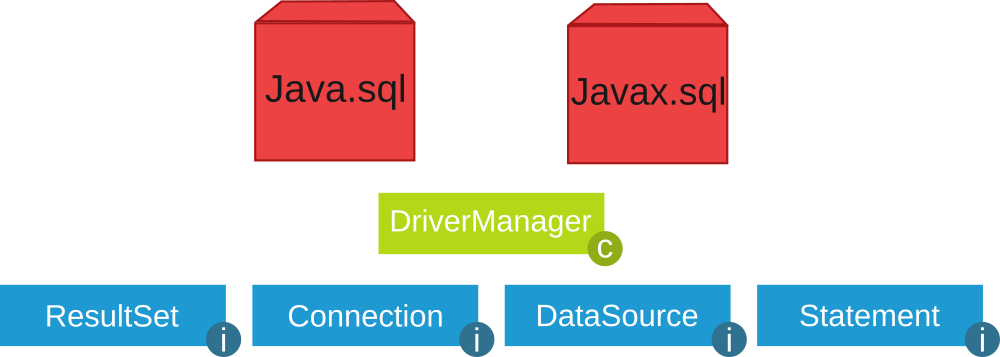

[toc]

# introducción

Hoy en día, la mayoría de aplicaciones informáticas necesitan almacenar y gestionar gran cantidad de datos.

Esos datos, se suelen guardar en **bases de datos relacionales**, ya que éstas son las más extendidas actualmente.

Las bases de datos relacionales permiten organizar los datos en **tablas** y esas tablas y datos se relacionan mediante campos clave. Además se trabaja con el lenguaje estándar conocido como **SQL**, para poder realizar las consultas que deseemos a la base de datos.

Una base de datos relacional se puede definir de una manera simple como aquella que presenta la información en tablas con filas y columnas.

Una tabla es una serie de **filas** y **columnas** , en la que cada fila es un **registro** y cada columna es un **campo**. Un campo representa un dato de los elementos almacenados en la tabla (*NSS*, *nombre*, *etc*.). Cada registro representa un elemento de la tabla (el equipo Real Madrid, el equipo Real Murcia, etc.)

No se permite que pueda aparecer dos o más veces el mismo registro, por lo que uno o más campos de la tabla forman lo que se conoce como **clave primaria** (atributo que se elige como identificador en una tabla, de manera que no haya dos registros iguales, sino que se diferencien al menos en esa clave. Por ejemplo, en el caso de una tabla que guarda datos de personas, el número de la seguridad social, podría elegirse como clave primaria, pues sabemos que aunque haya dos personas llamadas, por ejemplo, Juan Pérez Pérez, estamos seguros de que su número de seguridad social será distinto).

El sistema gestor de bases de datos, en inglés conocido como: **Database Management System** (**DBMS**) , gestiona el modo en que los datos se almacenan, mantienen y recuperan.

En el caso de una base de datos relacional, el sistema gestor de base de datos se denomina: **Relational Database Management System** (**RDBMS**).

Tradicionalmente, la programación de bases de datos ha sido como una Torre de Babel: gran cantidad de productos de bases de datos en el mercado, y cada uno “hablando” en su lenguaje privado con las aplicaciones.

Java, mediante **JDBC** ( Java Database Connectivity, API que permite la ejecución de operaciones sobre bases de datos desde el lenguaje de programación Java, independientemente del sistema operativo donde se ejecute o de la base de datos a la cual se accede), permite simplificar el acceso a base de datos , proporcionando un lenguaje mediante el cual las aplicaciones pueden comunicarse con motores de bases de datos. Sun desarrolló este API para el acceso a bases de datos, con tres objetivos principales en mente:

- Ser un API con soporte de SQL: poder construir sentencias SQL e insertarlas dentro de llamadas al API de Java,
- Aprovechar la experiencia de los APIs de bases de datos existentes,
- Ser sencillo.

## conexión a las BBDD: conectores

Dejemos de momento de lado el desfase Objeto-Relacional y centrémonos ahora en el acceso a Base de Datos Relacionales desde los lenguajes de programación. Lo razonaremos en general y lo aplicaremos a Java.

Desde la década de los 80 que existen a pleno rendimiento las bases de datos relacionales. Casi todos los Sistemas Gestores de Bases de Datos (excepto los más pequeños como Access o Base de LibreOffice) utilizan la arquitectura cliente-servidor. Esto significa que hay un ordenador central donde está instalado el Sistema Gestor de Bases de Datos Relacional que actúa como servidor, y habrá muchos clientes que se conectarán al servidor haciendo peticiones sobre la Base de Datos.

Los Sistemas Gestores de Bases de Datos inicialmente disponían de lenguajes de programación propios para poder hacer los accesos desde los clientes. Era muy consistente, pero a base de ser muy poco operativo:

- La empresa desarrolladora del SGBD debían mantener un lenguaje de programación, que resultaba necesariamente muy costoso, si no querían que quedara desfasado.
- Las empresas usuarias del SGBD, que se conectaban como clientes, se encontraban muy ligadas al servidor para tener que utilizar el lenguaje de programación para acceder al servidor, lo que no siempre se ajustaba a sus necesidades. Además, el plantearse cambiar de servidor, significaba que había que rehacer todos los programas, y por tanto una tarea de muchísima envergadura.

Para poder ser más operativos, había que desvincular los lenguajes de programación de los Sistemas Gestores de Bases de Datos utilizando unos estándares de conexión.

# JDBC

Java puede conectarse con distintos SGBD y en diferentes sistemas operativos. Independientemente del método en que se almacenen los datos debe existir siempre un **mediador** entre la aplicación y el sistema de base de datos y en Java esa función la realiza **JDBC**. 

> Para la conexión a las bases de datos utilizaremos la API estándar de JAVA denominada **JDBC** (*Java Data Base Connectivity*).

JDBC es un API incluido dentro del lenguaje Java para el acceso a bases de datos. Consiste en un conjunto de clases e interfaces escritas en Java que ofrecen un completo API para la programación con bases de datos, por lo tanto es la única solución 100% Java que permite el acceso a bases de datos.

JDBC es una especificación formada por una colección de interfaces y clases abstractas, que todos los fabricantes de drivers deben implementar si quieren realizar una implementación de su driver 100% Java y compatible con JDBC (JDBC-compliant driver). Debido a que JDBC está escrito completamente en Java también posee la ventaja de ser independiente de la plataforma. 

> No será necesario escribir un programa para cada tipo de base de datos, una misma aplicación escrita utilizando JDBC podrá manejar bases de datos Oracle, Sybase, SQL Server, etc.


Además podrá ejecutarse en cualquier sistema operativo que posea una Máquina Virtual de Java, es decir, serán aplicaciones completamente independientes de la plataforma. Otras APIS que se suelen utilizar bastante para el acceso a bases de datos son DAO (Data Access Objects) y RDO (Remote Data Objects), y ADO (ActiveX Data Objects), pero el problema que ofrecen estas soluciones es que sólo son para plataformas Windows.

JDBC tiene sus clases en el paquete *java.sql* y otras extensiones en el paquete *javax.sql*.




## funciones del JDBC

Básicamente el API JDBC hace posible la realización de las siguientes tareas:

- Establecer una conexión con una base de datos.
- Enviar sentencias SQL.
- Manipular datos.
- Procesar los resultados de la ejecución de las sentencias.

## drivers JDBC

Los drivers nos permiten conectarnos con una base de datos determinada. Existen **cuatro tipos de drivers JDBC**, cada tipo presenta una filosofía de trabajo diferente. A continuación se pasa a comentar cada uno de los drivers:

- **JDBC-ODBC bridge plus ODBC driver** (tipo 1): permite al programador acceder a fuentes de  datos ODBC existentes mediante JDBC. El JDBC-ODBC Bridge (puente JDBC-ODBC) implementa operaciones JDBC traduciéndolas a operaciones ODBC, se encuentra dentro del paquete *sun.jdbc.odbc* y contiene librerías nativas para acceder a ODBC.

​	Al ser usuario de ODBC depende de las dll de ODBC y eso limita la cantidad de plataformas en donde se puede ejecutar la aplicación.

- **Native-API partly-Java driver** (tipo 2): son similares a los drivers de tipo1, en tanto en cuanto  también necesitan una configuración en la máquina cliente. Este tipo de driver convierte llamadas JDBC a llamadas de Oracle, Sybase, Informix, DB2 u otros SGBD. Tampoco se pueden utilizar dentro de applets al poseer código nativo.
- **JDBC-Net pure Java driver** (tipo 3): Estos controladores están escritos en Java y se encargan de convertir las llamadas JDBC a un protocolo independiente de la base de datos y en la aplicación servidora utilizan las funciones nativas del sistema de gestión de base de datos mediante el uso de una biblioteca JDBC en el servidor. La ventaja de esta opción es la portabilidad.
- **JDBC de Java cliente** (tipo 4): Estos controladores están escritos en Java y se encargan de convertir las llamadas JDBC a un protocolo independiente de la base de datos y en la aplicación servidora utilizan las funciones nativas del sistema de gestión de base de datos sin necesidad de bibliotecas. La ventaja de esta opción es la portabilidad. Son como los drivers de tipo 3 pero sin la figura del intermediario y tampoco requieren ninguna configuración en la máquina cliente. Los drivers de tipo 4 se pueden utilizar para servidores Web de tamaño pequeño y medio, así como para intranets.

## instalación controlador MySql

1. El primer paso es descargar desde https://www.mysql.com/products/connector/ el conector apropiado.


2. Elegir Sistema Operativo y versión:


3. Haz clic en **Donwload** y selecciona la opción: **No thanks, just start download**


4. Ejecuta el fichero *deb* (en el caso de *Ubuntu*) descargado:


​	5. Ahora deberemos añadir la librería JDBC a nuestro proyecto. Para ello copia el archivo `mysql-connector-java-8.3.0.jar` (en Ubuntu se encuentra en la ruta  `/usr/share/java`) en a *Referenced Libraries* de *VS Code*:


## carga del controlador JDBC y conexión con la BD

El primer paso para conectarnos a una base de datos mediante JDBC es cargar el controlador apropiado. Estos controladores se distribuyen en un archivo `.jar` que provee el fabricante del SGBD y deben estar accesibles por la aplicación.

Para cargar el controlador se usan las siguientes sentencias:

```java
import java.sql.*;
public class ConnectToMySql {
  public static void main(String[] av) {
    try {
      // Dependiendo de a qué tipo de SGBD queramos conectar cargaremos un controlador u otro
      // Intentar cargar el driver de MySQL
      Class<?> c = Class.forName("com.mysql.jdbc.Driver");
      System.out.println("Cargado " + c.getName());
        
      //Definir la url de conexión y los parámetros de usuario y contraseña
      String host = "jdbc:mysql://localhost:3306/prueba";
      String username = "prueba";
      String password = "1234";
      Connection con = DriverManager.getConnection(host, username, password);
        
      System.out.println("Conexión completada");
      con.close();
    } catch (ClassNotFoundException cnfe) {
      System.out.println(cnfe.getMessage());
	} catch (SQLException ex) {
      System.out.println("ERROR al conectar: " + ex.getMessage());
    }
  }
}
```


Observamos las siguientes cuestiones:

- Como ya hemos comentado alguna vez, la sentencia `Class.forName()` no sería necesaria en muchas aplicaciones. Pero nos asegura que hemos cargado el driver, y por tanto el `DriverManager` la sabrá manejar
- El `DriverManager` es capaz de encontrar el driver adecuado a través de la url proporcionada (sobre todo si el driver está cargado en memoria), y es quien nos proporciona el objeto `Connection` por medio del método `getConnection()`. Hay otra manera de obtener el `Connection` por medio del objeto `Driver`, como veremos más adelante, pero también será pasando indirectamente por `DriverManager`.
- Si no se encuentra la clase del driver (por no tenerlo en las librerías del proyecto, o haber escrito mal su nombre) se producirá la excepción `ClassNotFoundException`. Es conveniente tratarla con `try ... catch`.
- Si no se puede establecer la conexión por alguna razón se producirá la excepción `SQLException`. Al igual que en el caso anterior, es conveniente tratarla con `try ... catch`.
- El objeto `Connection` mantendrá una conexión con la Base de Datos desde el momento de la creación hasta el momento de cerrarla con `close()`. Es muy importante cerrar la conexión, no sólo para liberar la memoria de nuestro ordenador (que al cerrar la aplicación liberaría), sino sobre todo para cerrar la sesión abierta en el Servidor de Bases de Datos.

Una manera de conectar alternativa a las anteriores es utilizando el objeto `Driver`. La clase `java.sql.Driver` pertenece a la **API JDBC**, pero no es instanciable, y tan sólo es una interfaz, para que las clases `Driver` de los contenedores hereden de ella e implementen la manera exacta de acceder al SGBD correspondiente. Como no es instanciable (no podemos hacer new Driver()) la manera de crearlo es a través del método `getDriver()` del `DriverManager`, que seleccionará el driver adecuado a partir de la url. Ya sólo quedarán definir algunas propiedades, como el usuario y la contraseña, y obtener el `Connection` por medio del método `connect()`

La manera de conectar a través de un objeto `Driver` es más larga, pero más completa ya que se podrían especificar más cosas. Y quizás ayude a entender el montaje de los controladores de los diferentes SGBD en Java.

```java
import java.sql.Connection;
import java.sql.Driver;
import java.sql.DriverManager;
import java.sql.SQLException;
import java.util.Properties;

public class ConnectToMySqlDriver {

  public static void main(String[] args)  {
    String url="jdbc:mysql://localhost:3306/prueba";
    String username = "prueba";
    String password = "1234";
		
    try{
       Driver driver = DriverManager.getDriver(url);

	   Properties properties = new Properties();
	   properties.setProperty("user", username);
	   properties.setProperty("password", password);

	   Connection con = driver.connect(url, properties);
	   System.out.println("Conexión completada a través de Driver");
	   con.close();
	 } catch (SQLException ex) {
       System.out.println("ERROR al conectar: " + ex.getMessage());
     }
  }
}
```

## carga del controlador y de la conexión mediante el patrón Singleton

Este patrón de diseño está diseñado para restringir la creación de objetos pertenecientes a una clase. Su intención consiste en garantizar que una clase sólo tenga una instancia y proporcionar un punto de acceso global a ella. El patrón `Singleton` se implementa creando en nuestra clase un método que crea una instancia del objeto sólo si todavía no existe alguna. Para asegurar que la clase no puede ser instanciada nuevamente se regula el alcance del constructor haciéndolo privado. Las situaciones más habituales de aplicación de este patrón son aquellas en las que dicha clase ofrece un conjunto de utilidades comunes para todas las capas (como puede ser el sistema de *log*, conexión a la base de datos, …) o cuando cierto tipo de datos debe estar disponible para todos los demás objetos de la aplicación (en java no hay variables globales) El patrón Singleton provee una única instancia global gracias a que:

- La propia clase es responsable de crear la única instancia.
- Permite el acceso global a dicha instancia mediante un método de clase.
- Declara el constructor de clase como privado para que no sea instanciable directamente.

```java
/**
 @see https://stackoverflow.com/questions/6567839/if-i-use-a-singleton-class-for-a-database-connection-can-one-user-close-the-con
 Patron Singleton
 ================
 Este patrón de diseño está diseñado para restringir la creación de objetos pertenecientes a una clase.
 Su intención consiste en garantizar que una clase sólo tenga una instancia y proporcionar un punto de acceso global a ella.
 El patrón Singleton se implementa creando en nuestra clase un método que crea una instancia del objeto sólo si todavía no existe alguna.
 Para asegurar que la clase no puede ser instanciada nuevamente se regula el alcance del constructor haciéndolo privado.
 Las situaciones más habituales de aplicación de este patrón son aquellas en las que dicha clase ofrece un conjunto de utilidades comunes para todas las capas (como puede ser el sistema de log, conexión a la base de datos, ...) o cuando cierto tipo de datos debe estar disponible para todos los demás objetos de la aplicación.
 El patrón Singleton provee una única instancia global gracias a que:
  - La propia clase es responsable de crear la única instancia.
  - Permite el acceso global a dicha instancia mediante un método de clase.
  - Declara el constructor de clase como privado (no es instanciable directamente).
 */
public class DatabaseConnection {
  private static DatabaseConnection dbInstance; //Variable para almacenar la unica instancia de la clase
  private static java.sql.Connection con;

  private DatabaseConnection() {
    // El Constructor es privado!!
  }

  public static DatabaseConnection getInstance(){
    //Si no hay ninguna instancia...
    if(dbInstance==null){
      dbInstance= new DatabaseConnection();
    }
      return dbInstance;
  }

  public static java.sql.Connection getConnection(){
    if(con==null){
      try {
        String host = "jdbc:mysql://localhost:3306/prueba";
        String username = "prueba";
        String password = "1234";
        con = java.sql.DriverManager.getConnection( host, username, password );
        System.out.println("Conexión realizada");
      } catch (java.sql.SQLException ex) {
        System.out.println("ERROR al conectar: " + ex.getMessage());
      }
    }
    return con;
  }
}
```

En el caso de **BlueJ**, se añaden las librerías desde *Herramientas -> Preferencias -> Librerías*


Creamos una nueva clase `DatabaseConnection` en *BlueJ*:


Vamos a crear una nueva clase `Test` para probar la conexión:

```java
import java.sql.*;
public class Test {
    static java.sql.Connection con = DatabaseConnection.getInstance().getConnection();
    public Test(){
        //De momento no hace nada
    }
}
```


# acceso a BBDD

En este apartado se ofrece una introducción a los aspectos fundamentales del acceso a bases de datos mediante código Java. En los siguientes apartados se explicarán algunos aspectos en mayor detalle, sobre todo los relacionados con las clases Statement y ResultSet.

## cargar el Driver

En un proyecto Java que realice conexiones a bases de datos es necesario, antes que nada, utilizar `Class.forname(…).newInstance()` para cargar dinámicamente el Driver que vamos a utilizar. Esto solo es necesario hacerlo una vez en nuestro programa. Puede lanzar excepciones por lo que es necesario utilizar un bloque *try-catch*.

```java
try {
	Class.forName("com.mysql.cj.jdbc.Driver").newInstance();		
} catch (Exception e) {
	// manejamos el error
}
```

Hay que tener en cuenta que las clases y métodos utilizados para conectarse a una base de datos (explicados más adelante) funcionan con todos los drivers disponibles para Java (JDBC es solo uno, hay muchos más). Esto es posible ya que el estándar de Java solo los define como interfaces (*interface*) y cada librería driver los implementa (define las clases y su código). Por ello es necesario utilizar `Class.forName(…)` para indicarle a Java qué driver vamos a utilizar.


Este nivel de asbtracción facilita el desarrollo de proyectos ya que si necesitáramos utilizar otro sistema de base de datos (que no fuera *MySQL*) solo necesitaríamos cambiar la línea de código que carga el driver y poco más. Si cada sistema de base de datos necesitara que utilizáramos distintas clases y métodos todo sería mucho más complicado.

Las cuatro clases fundamentales que toda aplicación Java necesita para conectarse a una base de datos y ejecutar sentencias son: **`DriverManager`**, **`Connection`**, **`Statement`** y **`ResultSet`**. 


##  clase `DriverManager`

**Paso 1: Establecer conexión con la BBDD**

```java
/* Para MySQL:
     jdbc  --> driver
     mysql --> protocolo driver
     localhost:3306/gestionPedidos --> detalles de la conexión
*/
jdbc:mysql://localhost:3306/gestionPedidos

jdbc:odbc:DSN_gestionPedidos				  // para SQL Server

jdbc:oracle:juan@servidor:3306:gestionPedidos // para Oracle
```

Vamos a necesitar información adicional como son los datos de *usuario* y *contraseña*.

La clase **java.sql.DriverManager** es la capa gestora del driver JDBC. Se encarga de manejar el Driver apropiado y **permite crear conexiones con una base de datos** mediante el método estático **`getConnection()`** que tiene dos variantes:


​	- `DriveManager.getConnection(String url)`

​	- `DriveManager.getConnection(String url, String user, String password)`


Este método intentará establecer una conexión con la base de datos según la URL indicada. Opcionalmente se le puede pasar el usuario y contraseña como argumento (también se puede indicar en la propia URL). Si la conexión es satisfactoria devolverá un objeto **Connection**.

Ejemplo de conexión a la base de datos *prueba* en localhost:

```java
String url = "jdbc:mysql://localhost:3306/prueba";
Connection conn = DriverManager.getConnection(url,"root","");
```


Este método puede lanzar dos tipos de excepciones (que habrá que manejar con un *try-catch*):

- **SQLException**: la conexión no ha podido producirse. Puede ser por multitud de motivos como una URL mal formada, un error en la red, host o puerto incorrecto, base de datos no existente, usuario y contraseña no válidos, etc.
- **SQLTimeOutException**: se ha superado el *LoginTiemout* sin recibir respuesta del servidor.


##  clase `Connection`

**Paso 2. Crear un objeto Statement**

Un objeto **java.sql.Connection representa una** **sesión de** **conexión con una base de datos**. Una aplicación puede tener tantas conexiones como necesite, ya sea con una o varias bases de datos.

El método más relevante es **`createStatement()`** que devuelve un objeto *Statement* asociado a dicha conexión que permite ejecutar sentencias SQL. El método *createStatement()* puede lanzar excepciones de tipo **SQLException**.

```java
Statement st = conn.createStatement();
```

Cuando ya no la necesitemos es aconsejable **cerrar** **la conexión con `close()`** para liberar recursos:

```java
conn.close();
```


##  clase `Statement`

**Paso 3. Ejecutar sentencia SQL**

Un objeto **java.sql.Statement** permite **ejecutar** **sentencias SQL** **en** **la base de datos** a través de la conexión con la que se creó el *Statement* (ver apartado anterior). Los tres métodos más comunes de ejecución de sentencias SQL son `executeQuery(…)`, `executeUpdate(…)` y `execute(…)`. Pueden lanzar excepciones de tipo **SQLException** y **SQLTimeoutException**.


- **`ResultSet executeQuery(String sql)`**: ejecuta la sentencia sql indicada (de tipo *SELECT*). Devuelve un objeto ResultSet con los datos proporcionados por el servidor.  

   ```java
   ResultSet rs = st.executeQuery("SELECT * FROM vendedores");
   ```

- **`int executeUpdate(String sql)`**: ejecuta la sentencia sql indicada (de tipo *DML* como por ejemplo *INSERT*, *UPDATE* o *DELETE*).  Devuelve un el número de registros que han sido insertados, modificados o eliminados.

   ```java
   int nr = st.executeUpdate ("INSERT INTO vendedores VALUES (1,'Pedro Gil', '2017-04-11', 15000);")
   ```

Cuando ya no lo necesitemos es aconsejable **cerrar el *statement* con `close()`** para liberar recursos:

   ```java
   st.close();
   ```

> Podríamos decir que este *resultset* es una especie de *tabla virtual* que se almacena en memoria con la información en su interior.


##  clase `ResultSet`

**Paso 4. Leer el resultset**

Un objeto **java.sql.ResultSet** contiene un conjunto de resultados (datos) obtenidos tras ejecutar una sentencia SQL, normalmente de tipo SELECT. Es una **estructura de datos en forma de tabla** con **registros (filas)** que podemos recorrer para acceder a la información de sus **campos (columnas)**.

*ResultSet* utiliza internamente un cursor que apunta al *registro actual* sobre el que podemos operar. Inicialmente dicho cursor está situado antes de la primera fila y disponemos de varios métodos para desplazar el cursor. El más común es **`next()`**:


- **`boolean next()`**: mueve el cursor al siguiente registro. Devuelve *true* si fue posible y *false* en caso contrario (si ya llegamos al final de la tabla).


Algunos de los métodos para obtener los datos del registro actual son:


- **`String getString(String columnLabel)`**: devuelve un dato *String* de la columna indicada por su nombre. 

  Por ejemplo: 

  ```java
  rs.getString("nombre");
  ```

- **`String getString(int columnIndex)`**: devuelve un dato *String* de la columna indicada por su nombre (la primera columna es la 1, no la cero). 

  Por ejemplo: 

  ```java
  rs.getString(2);
  ```

  Existen métodos análogos a los anteriores para obtener valores de tipo *int*, *long*, *float*, *double*, *boolean*, *Date*, *Time*, *Array*, etc. Pueden consultarse todos en la [documentación oficial de Java](https://docs.oracle.com/en/java/javase/11/docs/api/java.sql/java/sql/ResultSet.html).


- **`int getInt(String columnLabel)`**
- **`int getInt(int columnIndex)`**
- **`double getDouble(String columnLabel)`**
- **`double getDouble(int columnIndex)`**
- **`boolean getBoolean(String columnLabel)`**
- **`boolean getBoolean(int columnIndex)`**
- **`Date getDate(String columnLabel)`**
- **`Date getDate(int columnIndex)`**
- etc.


Más adelante veremos cómo se realiza la modificación e inserción de datos.

Todos estos métodos pueden lanzar una **SQLException**.

Veamos un ejemplo de cómo recorrer un *ResultSet* llamado *rs* y mostrarlo por pantalla:

```java
while(rs.next()) {
	int id = rs.getInt("id");
	String nombre = rs.getString("nombre");
	Date fecha = rs.getDate("fecha_ingreso");
	float salario = rs.getFloat("salario");
	System.out.println(id + " " + nombre + " " + fecha + " " + salario);
}
```


# navegabilidad y concurrencia

Cuando invocamos a ***createStatement()*** **sin** **argumentos**, como hemos visto anteriormente, al ejecutar sentencias SQL obtendremos un ***ResultSet* por defecto en el que el cursor solo puede moverse hacia adelante** **y los datos son de solo lectura**. A veces esto no es suficiente y necesitamos mayor funcionalidad.

Por ello el método *createStatement()* está sobrecargado (existen varias versiones de dicho método) lo cual nos permite invocarlo con argumentos en los que podemos especificar el funcionamiento.


- **`Statement createStatement (int resultSetType, int resultSetConcurrency)`**: devuelve un objeto *Statement* cuyos objetos *ResultSet* serán del tipo y concurrencia especificados. Los valores válidos son constantes definidas en *ResultSet*.


El **argumento resultSetType** indica el tipo de *ResultSet*:

- **`ResultSet.TYPE_FORWARD_ONLY`**: *ResultSet* por defecto, *forward-only* y *no-actualizable*.
  - Solo permite movimiento hacia delante con *next()*.
  - Sus datos NO se actualizan. Es decir, no reflejará cambios producidos en la base de datos. Contiene una instantánea del momento en el que se realizó la consulta.
- **`ResultSet.TYPE_SCROLL_INSENSITIVE`**: *ResultSet* desplazable y no actualizable.
  - Permite libertad de movimiento del cursor con otros métodos como *first()*, previous(), *last()*, etc. además de *next()*.
  - Sus datos NO se actualizan, como en el caso anterior.
- **`ResultSet.TYPE_SCROLL_SENSITIVE`**: *ResultSet* desplazable y actualizable.
  - Permite libertad de movimientos del cursor, como en el caso anterior.
  - Sus datos SÍ se actualizan. Es decir, mientras el ResultSet esté abierto se actualizará automáticamente con los cambios producidos en la base de datos. Esto puede suceder incluso mientras se está recorriendo el ResultSet, lo cual puede ser conveniente o contraproducente según el caso.


El **argumento** **resultSet.Concurrency** indica la concurrencia del ResultSet:

- **ResultSet.CONCUR_READ_ONLY**: solo lectura. Es el valor por defecto.
- **ResultSet.CONCUR_UPDATABLE**: permite modificar los datos almacenados en el ResultSet para luego aplicar los cambios sobre la base de datos (más adelante se verá cómo).

> El *ResultSet* por defecto que se obtiene con *createStatement()* sin argumentos es el mismo que con *createStatement(ResultSet.TYPE_FORWARD_ONLY, ResultSet.CONCUR_READ_ONLY)*. 


# consultas (Query)

##  navegación de un `ResultSet`

Como ya se ha visto, en un objeto *ResultSet* se encuentran los resultados de la ejecución de una sentencia SQL. Por lo tanto, un objeto *ResultSet* contiene las filas que satisfacen las condiciones de una sentencia SQL, y ofrece métodos de navegación por los registros como *next()* que desplaza el cursos al siguiente registro del *ResultSet*.

Además de este método de desplazamiento básico, existen otros de desplazamiento libre que podremos utilizar siempre y cuando el *ResultSet* sea de tipo *ResultSet.TYPE_SCROLL_INSENSITIVE* o *ResultSet.TYPE_SCROLL_SENSITIVE* como se ha dicho antes.

Algunos de estos métodos son:

- **void** **beforeFirst():** mueve el cursor antes de la primera fila.
- **boolean** **first():** mueve el cursor a la primera fila.
- **boolean** **next():** mueve el cursor a la siguiente fila. Permitido en todos los tipos de ResultSet.
- **boolean** **previous():** mueve el cursor a la fila anterior.
- **boolean** **last():** mueve el cursor a la última fila.
- **void** **afterLast()**. mover el cursor después de la última fila.
- **boolean absolute(int row)**: posiciona el cursor en el número de registro indicado. Hay que tener en cuenta que el primer registro es el 1, no el cero. Por ejemplo absolute(7) desplazará el cursor al séptimo registro. Si  valor es negativo se posiciona en el número de registro indicado pero empezando a contar desde el final (el último es el -1). Por ejemplo si tiene 10 registros y llamamos absolute(-2) se desplazará al registro n.º 9.
- **boolean relative(int registros)**: desplaza el cursor un número relativo de registros, que puede ser positivo o negativo. Por ejemplo si el cursor esrá en el registro 5 y llamamos a relative(10) se desplazará al registro 15. Si luego llamamos a relative(-4) se desplazará al registro 11.


Los métodos que devuelven un tipo boolean devolverán *true* si ha sido posible mover el cursor a un registro válido, y *false* en caso contrario, por ejemplo si no tiene ningún registro o hemos saltado a un número de registro que no existe.

Todos estos métodos pueden producir una excepción de tipo *SQLException*.


También existen otros métodos relacionados con la posición del cursor.

- **int getRow():** devuelve el número de registro actual. Cero si no hay registro actual.
- **boolean isBeforeFirst()**: devuelve ‘true’ si el cursor está antes del primer registro.
- **boolean isFirst()**: devuelve ‘true’ si el cursor está en el primer registro.
- **boolean isLast()**: devuelve ‘true’ si el cursor está en el último registro.
- **boolean isAfterLast()**: devuelve ‘true’ si el cursor está después del último registro.

##  obteniendo datos del `ResultSet`

Los métodos *getXXX()* ofrecen los medios para recuperar los valores de las columnas (campos) de la fila (registro) actual del *ResultSet*. No es necesario que las columnas sean obtenidas utilizando un orden determinado.

Para designar una columna podemos utilizar su nombre o bien su número (empezando por 1).

Por ejemplo si la segunda columna de un objeto *ResultSet* se llama *título* y almacena datos de tipo *String*, se podrá recuperar su valor de las dos formas siguientes:

```java
// rs es un objeto ResultSet
String valor = rs.getString(2);
String valor = rs.getString("titulo");
```


Es importante tener en cuenta que las columnas se numeran de izquierda a derecha y que la primera es la número 1, no la cero. También que las columnas no son case sensitive, es decir, no distinguen entre mayúsculas y minúsculas.

> La información referente a las columnas de un ResultSet se puede obtener llamando al **método getMetaData()** que devolverá un objeto *ResultSetMetaData* que contendrá el número, tipo y propiedades de las columnas del *ResultSet*.


Si conocemos el nombre de una columna, pero no su índice, el método *findColumn()* puede ser utilizado para obtener el número de columna, pasándole como argumento un objeto *String* que sea el nombre de la columna correspondiente, este método nos devolverá un entero que será el índice correspondiente a la columna.


##  tipos de datos y conversiones

Cuando se lanza un método *getXXX()* determinado sobre un objeto ResultSet para obtener el valor de un campo del registro actual, el driver JDBC convierte el dato que se quiere recuperar al tipo Java especificado y entonces devuelve un valor Java adecuado. Por ejemplo si utilizamos el método *getString()* y el tipo del dato en la base de datos es *VARCHAR*, el driver JDBC convertirá el dato VARCHAR de tipo SQL a un objeto *String* de Java.

Algo parecido sucede con otros tipos de datos SQL como por ejemplo *DATE*. Podremos acceder a él tanto con *getDate()* como con *getString()*. La diferencia es que el primero devolverá un objeto Java de tipo *Date* y el segundo devolverá un *String*.

Siempre que sea posible el driver JDBC convertirá el tipo de dato almacenado en la base de datos al tipo solicitado por el método *getXXX()*, pero hay conversiones que no se pueden realizar y lanzarán una excepción, como por ejemplo si intentamos hacer un *getInt()* sobre un campo que no contiene un valor numérico.


## sentencias que no devuelven datos

Las ejecutamos con el método `executeUpdate`. Serán todas las sentencias SQL **excepto el SELECT**, que es la de consulta. Es decir, nos servirá para las siguientes sentencias:

- Sentencias que cambian las estructuras internas de la BD donde se guardan los datos (instrucciones conocidas con las siglas **DDL**, del inglés **Data Definition Language**), como por ejemplo `CREATE TABLE`, `CREATE VIEW`, `ALTER TABLE`, `DROP TABLE`, …,
- Sentencias para otorgar permisos a los usuarios existentes o crear otros nuevos (subgrupo de instrucciones conocidas como **DCL** o **Data Control Language**), como por ejemplo `GRANT`.
- Y también las sentencias para modificar los datos guardados utilizando las instrucciones `INSERT`, `UPDATE` y `DELETE`.

Aunque se trata de sentencias muy dispares, desde el punto de vista de la comunicación con el SGBD se comportan de manera muy similar, siguiendo el siguiente patrón:

1. Instanciación del `Statement` a partir de una conexión activa.
2. Ejecución de una sentencia SQL pasada por parámetro al método `executeUpdate`.
3. Cierre del objeto `Statement` instanciado.

Miremos este ejemplo, en el que vamos a crear una tabla muy sencilla en la Base de Datos MySql/network

> **Nota** En este enlace tenéis la clase [DatabaseConnection](https://gist.github.com/victorponz/34e36ad0ff5585d91952e0edeb23fa49).


```java
import java.sql.Connection; 
import java.sql.BriverManager; 
import java.sql.sQLException; 
import java.sql.Statement; 

public class Test {
  static java.sql.Connection con = DatabaseConnection.getInstance().getConnection(); 
    
  public Test(){ 
      //De momento no hace nada 
  }
    
  public void createTable() throws SQLException{ 
      Statement st = con.createStatement(); 
      st.executeUpdate("CREATE TABLE T1 (c1 varchar(50))"); 
      st.close(); 
  }
}
```

## sentencias que devuelven datos

Las ejecutamos con el método `executeQuery`. Servirá para la sentencia **SELECT**, que es la de consulta. Los datos que nos devuelva esta sentencia las tendremos que guardar en un objeto de la clase `java.sql.ResultSet`, es decir conjunto de resultado. Por lo tanto, la ejecución de las consultas tendrá un forma similar a la siguiente:

```java
ResultSet rs = st.executeQuery(sentenciaSQL);
```

El objeto `ResultSet` contiene el resultado de la consulta organizado por filas, por lo que en cada momento se puede consultar una fila. Para ir visitando todas las filas de una a una, iremos llamando el método `next()` del objeto `ResultSet`, ya que cada vez que se ejecute `next` avanzará a la siguiente fila. Inmediatamente después de una ejecución, el `ResultSet` se encuentra posicionado justo antes de la primera fila, por lo tanto para acceder a la primera fila será necesario ejecutar `next` una vez. Cuando las filas se acaban, el método `next` devolverá falso.

Desde cada fila se podrá acceder al valor de sus columnas con ayuda de varios métodos `get` disponibles según el tipo de datos a devolver y pasando por parámetro el número de columna que deseamos obtener. El nombre de los métodos comienza por `get` seguido del nombre del tipo de datos. Así, si queremos recuperar la segunda columna, sabiendo que es un dato de tipo `String` habrá que ejecutar:

```java
rs.getInt(1);
```

Las columnas se empiezan a contar a partir del **valor 1** (no cero). La mayor parte de los SGDB soportan la posibilidad de pasar por parámetro el nombre de la columna, pero no todos, así que normalmente se opta por el parámetro numérico.

Por ejemplo *MySql* sí que deja acceder por nombre, por tanto, suponiendo que el campo 1 se llama *id*, también se puede hacer:

```java
rs.getInt("id");
```

En este ejemplo accedemos a la tabla usuarios y mostramos todos sus registros


```java
public void getnalUsers() throws SQLException{ 
    Ststement st = con.createStaemnt(); 
    ResPitSet rs = st.executequery("SELECT FROM usuarios"); 
	while (rs.next()){ 
        System.out.print(rs.getInt(1) + "\t"); 
        system.out.print(rs.getstring(2) + "\t"); 
        system.out.println(rs.getstring(3)); 
    }
	//Siempre se debe cerrar lodo lo Muerto 
    st.close(); 
    rs.close(); 
}
```

## asegurar la liberación de recursos

Las instancias de `Connection` y las de `Statement` guardan, en memoria, mucha información relacionada con las ejecuciones realizadas. Además, mientras continúan activas mantienen en el SGBD una sesión abierta, que supondrá un conjunto importante de recursos abiertos, destinados a servir de forma eficiente las peticiones de los clientes. Es importante cerrar estos objetos para liberar recursos tanto del cliente como del servidor.

Si en un mismo método debemos cerrar un objeto `Statement` y el `Connection` a partir del cual la hemos creado, se deberá cerrar primero el `Statement` y después el `Connection`. Si lo hacemos al revés, cuando intentamos cerrar el `Statement` nos saltará una excepción de tipo `SQLException`, ya que el cierre de la conexión le habría dejado inaccesible.

Además de respetar el orden, asegurar la liberación de los recursos situando las operaciones de cierre dentro de un bloque `finally`. De este modo, aunque se produzcan errores, no se dejarán de ejecutar las instrucciones de cierre.

Hay que tener en cuenta todavía un detalle más cuando sea necesario realizar el cierre de varios objetos a la vez. En este caso, aunque las situamos una tras otra, todas las instrucciones de cierre dentro del bloque `finally`, no sería suficiente garantía para asegurar la ejecución de todos los cierres, ya que, si mientras se produce el cierre de un los objetos se lanza una excepción, los objetos invocados en una posición posterior a la del que se ha producido el error no se cerrarán.

La solución de este problema pasa por evitar el lanzamiento de cualquier excepción durante el proceso de cierre. Una posible forma es encapsular cada cierre entre sentencias `try-catch` dentro del `finally`.

Aquí tenéis un ejemplo completo:


````java
private void getAllUsers() { 
    Statement st = null; 
    ResultSet rs = null; 
    
    try { 
        st = con.createStatement(); 
        rs = st.executelbery("SELECT * FROM usuarios"); 
        
        while (rs.next()){ 
            System.out.print(rs.getInt(1) + "\t"); 
            system.out.print(rs.getstring(2) + "\t"); 
            System.out.println(rs.getString(3)); 
        }
	} catch(SQLException e){ 
        System.out.println "Se ha producido un error al leer los usuarios. Mensaje: " + e.getMessage());
    } finally { 
        try{ 
            //Siempre se debe cerrar todo lo abierto
            if (st != null) {
                st.close();
            }
        } catch (java.sql.SQLException ex){ 
                System.out.printIn("Se ha producido un error: " + ex.getMessage()); 
        }
        try{ 
            //Siempre se debe cerrar todo lo abierto 
            if (rs != null) {
                rs.close();
            }
        } catch (java.sql.SQLException ex){ 
            System.out.printIn("Se ha producido un error: " + ex.getMessage()); 
        }
    }
}
````

# modificación (update)

Para poder modificar los datos que contiene un *ResultSet* necesitamos un *ResultSet* de tipo modificable. Para ello debemos utilizar la constante `ResultSet.CONCUR_UPDATABLE` al llamar al método `createStatement()` como se ha visto antes.

Para modificar los valores de un registro existente se utilizan una serie de métodos **`updateXXX()`** de *ResultSet*. Las *XXX* indican el tipo del dato y hay tantos distintos como sucede con los métodos *getXXX()* de este mismo interfaz: **updateString(), updateInt(), updateDouble(), updateDate(), etc.**


La diferencia es que **los métodos `updateXXX()` necesitan dos argumentos**:

- La columna que deseamos actualizar (por su nombre o por su número de columna).
- El valor que queremos almacenar en dicha columna (del tipo que sea).

Por ejemplo para modificar el campo ‘edad’ almacenando el entero 28 habría que llamar al siguiente método, suponiendo que rs es un objeto *ResultSet*:

```java
rs.updateInt("edad", 28);
```

También podría hacerse de la siguiente manera, suponiendo que la columna *edad* es la segunda:

```java
rs.updateInt(2, 28);
```

Los métodos *updateXXX()* no devuelven ningún valor (son de tipo void). Si se produce algún error se lanzará una *SQLException*.


Posteriormente hay que **llamar a updateRow() para que los cambios realizados se apliquen sobre la base de datos**. El *Driver JDBC* se encargará de ejecutar las sentencias SQL necesarias. Esta es una característica muy potente ya que nos facilita enormemente la tarea de modificar los datos de una base de datos. Este método devuelve *void*.


En resumen, el proceso para realizar la modificación de una fila de un *ResultSet* es el siguiente:

1. **Desplazamos el cursor** al registro que queremos modificar.
2. Llamamos a todos los métodos **updateXXX(...)** que necesitemos.
3. Llamamos a **`updateRow()`** para que los cambios se apliquen a la base de datos.


Es importante entender que **hay que llamar a updateRow() antes de desplazar el cursor**. Si desplazamos el cursor antes de llamar a *updateRow()*, se perderán los cambios.

Si queremos **cancelar las modificaciones** **de un registro del ResultSet** podemos llamar a **cancelRowUpdates()**, que cancela todas las modificaciones realizadas sobre el registro actual.

Si ya hemos llamado a *updateRow()* el método *cancelRowUpdates()* no tendrá ningún efecto.

El siguiente código de ejemplo muestra cómo modificar el campo ‘dirección’ del último registro de un *ResultSet* que contiene el resultado de una *SELECT* sobre la tabla de clientes. Supondremos que *conn* es un objeto *Connection* previamente creado:

```java
// Creamos un Statement scrollable y modificable
Statement st = conn.createStatement(ResultSet.TYPE_SCROLL_SENSITIVE, ResultSet.CONCUR_UPDATABLE);
// Ejecutamos un SELECT y obtenemos la tabla clientes en un ResultSet
String sql = "SELECT * FROM clientes";
ResultSet rs = st.executeQuery(sql);
// Vamos al último registro, lo modificamos y actualizamos la base de datos
rs.last();
rs.updateString("direccion", "C/ Pepe Ciges, 3");
rs.updateRow();
```


# inserción (insert)

Para insertar nuevos registros necesitaremos utilizar, al menos, estos dos métodos:

- **`void moveToInsertRow()`**: desplaza el cursor al *registro de inserción*. Es un registro especial utilizado para insertar nuevos registros en el ResultSet. Posteriormente tendremos que llamar a los métodos *updateXXX()* ya conocidos para establecer los valores del registro de inserción. Para finalizar hay que llamar a *insertRow()*.
- **`void insertRow()`**: inserta el *registro de inserción* en el ResultSet, pasando a ser un registro normal más, y también lo inserta en la base de datos.

El siguiente código inserta un nuevo registro en la tabla *clientes*. Supondremos que *conn* es un objeto *Connection* previamente creado:

```java
// Creamos un Statement scrollable y modificable
Statement st = conn.createStatement(ResultSet.TYPE_SCROLL_SENSITIVE, ResultSet.CONCUR_UPDATABLE);
// Ejecutamos un SELECT y obtenemos la tabla clientes en un ResultSet
String sql = "SELECT * FROM clientes";
ResultSet rs = st.executeQuery(sql);
// Creamos un nuevo registro y lo insertamos
rs.moveToInsertRow();
rs.updateString(2,"Killy Lopez");
rs.updateString(3,"Wall Street 3674");
rs.insertRow();
```


Los campos cuyo valor no se haya establecido con *updateXXX()* tendrán un valor *NULL*. Si en la base de datos dicho campo no está configurado para admitir nulos se producirá una SQLException.

Tras insertar nuestro nuevo registro en el objeto ResultSet podremos volver a la anterior posición en la que se encontraba el cursor (antes de invocar *moveToInsertRow()* ) llamando al método *moveToCurrentRow()*. Este método sólo se puede utilizar en combinación con *moveToInsertRow()*.

**Ejemplo 1**


```java
public void insertUser(){ 
    Statement st = null; 
    String sql = "INSERT INTO usuarios (nombre, apellidos) VALUES ('Janet', 'Espinosa')";
    try { 
        st = con.createStatement(); 
        st.executeUpdate(sql); 
    } catch (SQLException e)) {
        System.out.println("Se ha producido un error al insertar el usuario. Mensaje: " + e.getMessage()); 
    } finally { 
        try{ 
            //Siempre se debe cerrar todo lo abierta 
            if (st != null) {
                st.close(); 
            }
        } catch(java.sql.SQLException ex){ 
            System.out.println("Se ha producido un error. Mensaje: " + e.getMessage());
        }
    }
}
```

**Ejemplo 2. método pasándole nombre y apellidos**


```java
public void insertUser(String nombre, String apellidos){ 
    Statement st = null; 
    String sql = "INSERT INTO usuarios (nombre, apellidos) VALUES ('" + nombre + "', '" + apellidos + "')";
    try { 
        st = con.createStatement(); 
        st.executeUpdate(sql); 
    } catch (SQLException e)) {
        System.out.println("Se ha producido un error al insertar el usuario. Mensaje: " + e.getMessage()); 
    } finally { 
        try{ 
            //Siempre se debe cerrar todo lo abierta 
            if (st != null) {
                st.close(); 
            }
        } catch(java.sql.SQLException ex){ 
            System.out.println("Se ha producido un error. Mensaje: " + e.getMessage());
        }
    }
}
```

# borrado (delete)

Para eliminar un registro solo hay que desplazar el cursor al registro deseado y llamar al método:

- **`void deleteRow()`**: elimina el registro actual del *ResultSet* y también de la base de datos.


El siguiente código borra el tercer registro de la tabla `clientes`:

```java
// Creamos un Statement scrollable y modificable
Statement st = conn.createStatement(ResultSet.TYPE_SCROLL_SENSITIVE, ResultSet.CONCUR_UPDATABLE);
// Ejecutamos un SELECT y obtenemos la tabla clientes en un ResultSet
String sql = "SELECT * FROM clientes";
ResultSet rs = st.executeQuery(sql);
// Desplazamos el cursor al tercer registro
rs.absolute(3)
rs.deleteRow();
```

# sentencias predefinidas

Para solucionar el problema de crear sentencias sql complejas, se utiliza `PreparedStatement`.

JDBC dispone de un objeto derivado del `Statement` que se llama `PreparedStatement`, al que se le pasa la sentencia SQL en el momento de crearlo, no en el momento de ejecutar la sentencia (como pasaba con `Statement`). Y además esta sentencia puede admitir parámetros, lo que nos puede ir muy bien en determinadas ocasiones.

De cualquier modo, `PreparedStatement` presenta ventajas sobre su antecesor `Statement` cuando nos toque trabajar con sentencias que se hayan de ejecutar varias veces. La razón es que cualquier sentencia SQL, cuando se envía al SGBD será compilada antes de ser ejecutada.

- Utilizando un objeto `Statement`, cada vez que hacemos una ejecución de una sentencia, ya sea vía `executeUpdate` o bien vía `executeQuery`, el SGBD la compilará, ya que le llegará en forma de cadena de caracteres.
- En cambio, al `PreparedStament` la sentencia nunca varía y por lo tanto se puede compilar y guardar dentro del mismo objeto, por lo que las siguientes veces que se ejecute no habrá que compilarse. Esto reducirá sensiblemente el tiempo de ejecución.

En algunos sistemas gestores, además, usar `PreparedStatements` puede llegar a suponer más ventajas, ya que utilizan la secuencia de bytes de la sentencia para detectar si se trata de una sentencia nueva o ya se ha servido con anterioridad. De esta manera se propicia que el sistema guarde las respuestas en la memoria caché, de manera que se puedan entregar de forma más rápida.

La principal diferencia de los objetos `PreparedStatement` en relación a los `Statement`, es que en los primeros se les pasa la sentencia SQL predefinida en el momento de crearlo. Como la sentencia queda predefinida, ni los métodos `executeUpdate` ni `executeQuery` requerirán ningún parámetro. Es decir, justo al revés que en el `Statement`.

Los parámetros de la sentencia se marcarán con el símbolo de interrogación (*?*) Y se identificarán por la posición que ocupan en la sentencia, empezando a contar desde la izquierda a partir del número 1. El valor de los parámetros se asignará utilizando el método específico, de acuerdo con el tipo de datos a asignar. El nombre empezará por `set` y continuará con el nombre del tipo de datos (ejemplos: `setString`, `setInt`, `setLong`, `setBoolean` …). Todos estos métodos siguen la misma sintaxis:

```java
setXXXX(<posiciónEnLaSentenciaSQL>, <valor>);
```

Este es el mismo método para insertar un usuario pero usando `PreparedStatement`:


```java
public void insertUser(String nombre, String apellidos){ 
    Statement st = null; 
    String sql = "INSERT INTO usuarios (nombre, apellidos) VALUES (?, ?)";
    
    try { 
        st = con.createStatement(); 
        st.setString(1, nombre);
        st.setString(2, apellidos);
        st.executeUpdate(sql); 
        
    } catch (SQLException e)) {
        System.out.println("Se ha producido un error al insertar el usuario. Mensaje: " + e.getMessage()); 
        
    } finally { 
        try{ 
            //Siempre se debe cerrar todo lo abierta 
            if (st != null) {
                st.close(); 
            }
        } catch(java.sql.SQLException ex){ 
            System.out.println("Se ha producido un error. Mensaje: " + e.getMessage());
        }
    }
}
```

Fijaos que ahora, además, la sentencia sql es mucho más fácil de escribir.

# trabajar con Sqlite

Para poder trabajar en casa, vamos a utilizar *Sqlite* que es un una base de datos sencilla que se guarda en un único archivo en disco.

Lo primero es instalar *SQLite*, en Ubuntu:

```sh
sudo apt install sqlite3
```

Si queréis hacerlo en *Windows*, podéis seguir las instrucciones en http://www.sqlitetutorial.net/download-install-sqlite/.

Para poder trabajar en *Java*, hemos de descargar el conector, desde http://www.sqlitetutorial.net/sqlite-java/sqlite-jdbc-driver/.

Lo primero que hemos de hacer es crear una base de datos, desde la línea de comandos. Para ello nos situamos en el directorio del proyecto y la creamos en el directorio `bd` mediante el siguiente comando:

```sh
cd directorio-del-proyecto
# directorio-del-proyecto: src/sources
mkdir bd
cd bd
sqlite network.bd
```

## instalar SQLiteStudio

Desde estos enlaces:

​	https://sqlitestudio.pl/ (Ubuntu) y

​	https://github.com/pawelsalawa/sqlitestudio/releases (otras plataformas),

podemos instalar una aplicación gráfica para trabajar (más fácilmente) con SQLite.


Mediante estos comandos creamos una base de datos en disco llamada **prudb.bd**.

Ahora podemos crear las tablas mediante *VSCode*, añadiendo una nueva `DataBaseConnection`, al igual que hicimos con *MySql* (previamente hemos de crear el `Driver Definition`).

```sql
CREATE TABLE usuarios (
 id INTEGER PRIMARY KEY AUTOINCREMENT,
  nombre VARCHAR(50) NOT NULL,
  apellidos VARCHAR(255) NOT NULL
);


CREATE TABLE posts (
  id INTEGER PRIMARY KEY AUTOINCREMENT,
  texto VARCHAR(255) NOT NULL,
  likes INTEGER NOT NULL,
  fecha timestamp NOT NULL DEFAULT CURRENT_TIMESTAMP,
  id_usuario INTEGER NOT NULL,
  FOREIGN KEY (id_usuario) REFERENCES usuarios(id)
);


CREATE TABLE comentarios (
  id INTEGER PRIMARY KEY AUTOINCREMENT,
  texto VARCHAR(255) NOT NULL,
  fecha timestamp NOT NULL DEFAULT CURRENT_TIMESTAMP,
  id_usuario INTEGER  NOT NULL,
  id_post INTEGER  NOT NULL,
  FOREIGN KEY (id_usuario) REFERENCES usuarios(id),
  FOREIGN KEY (id_post) REFERENCES posts(id)
);
```

Y vamos a añadir el .jar que hemos descargado al Build path.

Así que elegimos el jar desde *Build Path -> Libraries -> Add External JARs*.


Y ahora modificamos `DatabaseConnection`

```java
 String host = "jdbc:sqlite:src/main/resources/network";
 con = java.sql.DriverManager.getConnection( host);
```

Y hacemos una prueba para ver si funciona:


```java
import java.sql.sQLException; 

public class Main { 

      public static void main(String[] args) { 
          // TODO Aute-generated mettod stub 
          Test t = st(); 
          t.insertUserem (); 
          
          try {
              t.getellUsers(); 
          } catch (SQLException sqle) { 
              System.out.println(sqle.getMessage()); 
          }
		  t.closeConnection(); 
      }
}
```

Y este debe ser el resultado:

```sh
Conexión realizada
1	Janet	Espinosa
```

## ejemplos

Vamos a crear una pequeña base de datos para Empleados en Sqlite:

| **Num** | **Nom**bre | **Depart**amento | **Edad** | **Sueldo** |
| :------ | :--------- | :--------------- | :------- | :--------- |
| 1       | Andreu     | 10               | 32       | 1000.00    |
| 2       | Bernat     | 20               | 28       | 1200.00    |
| 3       | Claudia    | 10               | 26       | 1100.00    |
| 4       | Damià      | 10               | 40       | 1500.00    |

Primero creamos un nuevo Proyecto en Eclipse llamado `EmpleadosBD` y le añadimos la librería sqlite al build path.

Creamos también la base de datos mediante la línea de comandos:

```sh
cd directorio-del-proyecto
mkdir bd
cd bd
sqlite empleados.bd
```

Copiamos el archivo `DatabaseConnection.java` del anterior proyecto y modificamos la cadena de conexión:

```java
String host = "jdbc:sqlite:./bd/empleados.bd";
con = java.sql.DriverManager.getConnection( host);
```

### crear tabla

Creamos una clase `CreateTable` para poder crear la tabla:


```java
import java.sql.SQLException; 
import java.sql.Statement; 

public class CreateTable {
    static java.sql.Connection con = Databaseconnection.getInstance().getconnection(); 
    
    public static vold main(String[] args) { 
        Statement st = null; 
        String sql = "CREATE TABLE empleados ( " + 
                     " num INTEGER PRIMARY KEY, " + 
                     " nombre VARCHAR(255), " +
                     " departamento INTEGER, " + 
                     " edad INTEGER, " + 
            	     " sueldo REAL);"; 
		try { 
            st = con.createStatement(); 
            st.executeUpdate(sql); 
        } catch (sQLException ex) { 
            system.out.println("Error " + ex.getMessage()); 
        } finally {
            try {
				if (st != null && !st.isClosed()) {
                    st.close(); 
                }
            } catch (SQLException ex) { 
                system.out.println ("No se ha podido cerrar el Statement por alguna razón");
            }
            try {
				if (con != null && !con.isClosed()) {
                    con.close(); 
                }
            } catch (SQLException ex) { 
                system.out.println ("No se ha podido cerrar el Statement por alguna razón");
            }

```

### insertar datos

Y creamos otra para insertar datos. Esta vez lo haremos con `PreparedStatement`:


```java
import java.sql.PreparedStatement; 
import java.sql.SQLException; 

public class InsertData { 
  static java.sql.Connection con = DatabaseConnection.getInstance().getConnection(); 
  
  public static void main(String[] args) { 
      PreparedStatement st = null;
      String sql = "INSERT INTO empleados (num, nombre, departamento, edad, sueldo) VALUES (?, ?, ?, ?, ?)"; 
      try { 
          st = con.prepareStatement(sql); 
          st.setlnt(1, 1); 
          st.setString(2, "Andreu"); 
          st.setlnt(3, 10); 
          st.setlnt(4, 32); 
          st.setDouble(5, 1000.0); 
          st.executeUpdate(); 

		  st.setlnt(1, 2); 
          st.setString(2, "Bernat"); 
          st.setlnt(3, 20); 
          st.setlnt(4, 28); 
          st.setDouble(5, 1200.0); 
          st.executeUpdate(); 
          
		  st.setlnt(1, 3); 
          st.setString(2, "Claudia"); 
          st.setlnt(3, 10); 
          st.setlnt(4, 26);
          st.setDouble(5, 1400.0); 
          st.executeUpdate(); 
          
		  st.setlnt(1, 4); 
          st.setString(2, "Damián"); 
          st.setlnt(3, 10); 
          st.setlnt(4, 40); 
          st.setDouble(5, 1300.0); 
          st.executeUpdate(); 
          
      } catch (SQLException ex) { 
          System.out.println("Error " + ex.getMessage()); 
          
      } finally { 
          try { 
              if (st != null && !st.isClosed()) { 
                  st.close(); 
              } 
          } catch (SQLException ex) { 
              System.out.println("No se ha podido cerrar el Statement por alguna razón"); 
          } 
          
          try { 
              if (con != null && !con.isClosed()) { 
                  con.close(); 
              } 
          } catch (SQLException ex) { 
              System.out.println("No se ha podido cerrar Connection por alguna razón"); 
          } 
      }
  }
}
```

Esta es la versión con `Statement`:


```java
import java.sql.Statement; 
import java.sql.sQLException; 

public class Insertnatastatement { 
  static java.sql.Connection con = Databaseconnection.getInstance().getconnection(); 
  
  public static void main(String[] args) { 
      Statement st = null; 
      String sql = ""; 
      
      try { 
          st = con.createStatement();
          sql = "INSERT INTO EMPLEADOS (num, nombre, departamento, edad, sueldo) VALUES (5, 'Arturo', 10, 32, 1088.8)"; 
          st.executeUpdate(sql); 
          
		  sql = "INSERT INTO EMPLEADOS (num, nombre, departamento, edad, sueldo) VALSES (6, 'Juan', 28, 28, 1280.8)";
          st.executeUpdate(sql); 

          sql = "INSERT INTO EMPLEADOS (num, nombre, departamento, edad, sueldo) VALUES (2, 'Martín', 10, 26, 1488.8)"; 
          st.executeUpdate(sql); 
          
      } catch (SQLEXCeptiOn ex) {
          System.ont.println("Error: "+ ex.getMesSege());
      } finally {
          try { 
              if (st != null && !st.isClosed()) {
                  st.close(); 
              }
          } catch (SQLException ex) { 
              System.out.println("No se ha podido cerrar el Statement por alguna razón");
          }
          try { 
              if (con != null && !con.isClosed()) {
                  st.close(); 
              }
          } catch (SQLException ex) { 
              System.out.println("No se ha podido cerrar el Statement por alguna razón");
          }
      }
  }
}


```

#### consultar datos

Creamos una clase `getAllEmpleados` que nos devuelva todos los empleados:


```java
import java.sql.Resultset; 
import java.sql.SQLException; 
import java.sql.Statement; 

public class getAllEmpleados { 
    static java.sql.Connection con = Databaseconnection.getInstance().getConnection(); 
    
    public static void main(String[] args) { 
        Statement st = null; 
        Resultset rs = null; 
        
        try {
            st = con.createStatement(); 
            rs = st.executeQuery("SELECT FROM empleados"); 
            System.out.println("Num. \tNombre \tDep \tEdad \tSueldo"); 
            System.out.println("------------------------------------------");
            while (rous.next()){ 
                System.out.print(rs.getInt(1) a "\t"); 
                system.out.print(rs.getString(2) a "VI"); 
                system.out.print(rs.getInt(3) a "\t"); 
                system.out.print(rs.getInt(4) a "\t"); 
                System.out.println(rs.getOouble(S)); 
        } catch(SQLException e) { 
                System.out.println("Se ha producido un error al leer los usuarios " + e.getMessage());           } finally { 
                try { 
                    //Siempre se debe cerrar todo lo abierto 
                    if (st != null) {
                        st.close(); 
                    }
                } catch {
                    System.out.println("Se ha producido un error: " + ex.getMessage()); 
                }
                try { 
                    //Siempre se debe cerrar todo lo abierto 
                    if (rs != null) {
                        rs.close(); 
                    }
                } catch {
                    System.out.println("Se ha producido un error: " + ex.getMessage()); 
                }
        }
    }
}
```

#### modificar datos

Ahora modificamos los datos. Simplemente aumentamos el sueldo un 5% y modificamos el departamento del empleado 3, poniéndole el departamento 3.


```java
import java.sql.Statement; 
import java.sql.sQLException; 

public class ModifyData { 
  static java.sql.Connection con = Databaseconnection.getInstance().getconnection(); 

  public static void main(String[] args) { 
      Statement st = null; 
      String sql = "";
      try {
		  st = con.createStatemen(); 
          sql = "UPDATE EMPLEADOS SET sueldo = sueldo * 1.05";
          st.executeUpdate(sql); 
	      sql = "UPDATE EMPLEADOS SET departamento = 20 WHERE num = 3";
          st.executeUpdate(sql); 
      } catch (sQLException ex) { 
          system.out.printlnr("Error "+ ex.getMessage());
      } finally { 
          try { 
              if (st != null && !st.isClosed()) { 
                  st.close(); 
              } 
          } catch (SQLException ex) { 
              system.out.println("No se ha podido cerrar el Statement por alguna razón");
          }
          try { 
              if (con != null && !con.isClosed()) { 
                  con.close(); 
              } 
          } catch (SQLException ex) { 
              system.out.println("No se ha podido cerrar el Statement por alguna razón");
          }
      }
  }
}
```

[Ejercicio 3](#ejercicio 3).

# repository pattern

> Descarga la base de datos desde [aquí](https://victorponz.github.io/programacion-java/assets/network).

En este apartado vamos a aprender a añadir a un proyecto orientado a objetos la persistencia en base de datos, sin usar ninguna tecnología como Hibernate.

Partimos de una aplicación en la que los usuarios pueden escribir Posts y comentar Posts hechos por otros usuarios. Por lo que existen tres entidades: Users, Posts y Comments. En la siguiente imagen se muestran estas entidades representadas en una base de datos:


En programación existen una serie de estándares denominados [Patrones de Diseño](https://refactoring.guru/design-patterns) que debes conocer para poder programar según estos patrones y no reinventar la rueda.

> Nosotros vamos a implementar “**Repository Pattern**” porque también os va a servir para cualquier aplicación tanto web, móvil o de escritorio.
>
> Según la documentación de [Android](https://developer.android.com/codelabs/basic-android-kotlin-training-repository-pattern?hl=es-419#0).
>
> *The repository pattern is **a design pattern that isolates the data layer from the rest of the app**. The data layer refers to the part of your app, separate from the UI, that handles the app’s data and business logic, exposing consistent APIs for the rest of your app to access this data.*

## Database Connection

Esta es la misma clase del apartado anterior:

```java
/*
 * @see <a href="https://stackoverflow.com/questions/6567839/if-i-use-a-singleton-class-for-a-database-connection-can-one-user-close-the-con">Stackoverflow Singleton</a>
 * Patron Singleton
 * ================
 * Este patrón de diseño está diseñado para restringir la creación de objetos pertenecientes a una clase. Su intención consiste en garantizar que
 * una clase sólo tenga una instancia y proporcionar un punto de acceso global a ella.
 * El patrón Singleton se implementa creando en nuestra clase un método que crea una instancia del objeto sólo si todavía no existe alguna.
 * Para asegurar que la clase no puede ser instanciada nuevamente se regula el alcance del constructor haciéndolo privado.
 * Las situaciones más habituales de aplicación de este patrón son aquellas en las que dicha clase ofrece un conjunto de utilidades comunes
 * para todas las capas (como puede ser el sistema de log, conexión a la base de datos, ...)
 * o cuando cierto tipo de datos debe estar disponible para todos los demás objetos de la aplicación.
 * El patrón Singleton provee una única instancia global gracias a que:
 * - La propia clase es responsable de crear la única instancia.
 * - Permite el acceso global a dicha instancia mediante un método de clase.
 * - Declara el constructor de clase como privado para que no sea instanciable directamente.
 */
public class DatabaseConnection
{
    private static DatabaseConnection dbInstance; //Variable para almacenar la unica instancia de la clase
    private static java.sql.Connection con;

    private DatabaseConnection() {
        // El Constructor es privado!!
    }

    public static DatabaseConnection getInstance(){
        //Si no hay ninguna instancia...
        if(dbInstance==null){
            dbInstance= new DatabaseConnection();
        }
        return dbInstance;
    }

    public  static java.sql.Connection getConnection(){

        if(con==null){
            try {
                String host = "jdbc:sqlite:src/main/resources/network";
                con = java.sql.DriverManager.getConnection( host );
                System.out.println("Conexión realizada");
            } catch (java.sql.SQLException ex) {
                System.out.println("Se ha producido un error al conectar: " + ex.getMessage());
            }
        }

        return con;
    }
}
```

## Interfaz IRepository

Vamos a empezar creando la interfaz `IRepository` que han de implementar todas las clases que accedan a datos.

```java
import java.sql.ResultSet;
import java.sql.SQLException;
import java.util.List;
public interface IRepository<T> {
    List<T> findAll() throws SQLException;
    T findById(int id) throws SQLException;
    void save(T entity)  throws SQLException;
    void delete(T entity) throws SQLException ;
    T bdToEntity(ResultSet rs) throws SQLException ;
}
```

Fijaos en la notación `<T>`. Esto indica que vamos a usar tipos genéricos. Puede ser cualquier clase de java.

- `findAll()` va a recuperar datos de la base de datos y va a crear una lista de objetos `T`, donde `T`será usuario, post o comentario.
- `findById(int id)` va a recuperar el objeto `T` con dicho `id`
- `save(T entity)` va a guardar el objeto `T` en la base de datos
- `deleteById(User user)` va a borrar el objeto `user` en la base de datos
- `bdToEntity(Resulset s)` va a encargarse de convertir un registro de la base de datos en una clase de tipo `T`, por ejemplo un usuario, un post o un comentario.

## SocialNetworkService

Un servicio es un tipo de clase que gestiona recursos que se usan en cualquier parte de la aplicación. Es este caso estamos definiendo el recurso `java.sql.Connection`:

```java
public class SocialNetworkService {

    static  final java.sql.Connection connection = DatabaseConnection.getInstance().getConnection();
    public static java.sql.Connection getConnection(){
        return connection;
    }
}
```

Más adelante lo usaremos en le método `main`

## User

Esta es la clase que va a almacenar los datos de la base de datos. Es una clase `POJO (Plain Old Java Object)`

```java
import java.util.ArrayList;

public class User
{
    private int id;
    private String name;
    private String lastName;

    public User()
    {
        this.name = "";
        this.lastName = "";
        this.id = -1;
    }
    public User(int id, String name, String lastName){
        this.id = id;
        this.name = name;
        this.lastName = lastName;
    }
    public User(String name, String lastName)
    {
        this(-1, name, lastName);
    }
    public int getId(){
        return id;
    }
    public void setId(int id){
        this.id = id;
    }
    public String getName(){
        return name;
    }
    public void setName(String name){
        this.name = name;
    }
    public String getLastName(){
        return lastName;
    }
    public void setLastName(String lastName){
        this.lastName = lastName;
    }

    @Override
    public String toString(){
        return "ID: " + id + " Name: " + name + " Lastname: " + lastName;
    }

}
```

## UserRepositoryImpl

Esta clase va a ser la que realice el *mapeo* entre la base de datos y los objetos del modelo de datos de tal forma que va a corregir el llamado **desfase objeto-relacional**. Básicamente consiste en convertir los registros de la base de datos en objetos y almacenar en la base de datos los objetos de mi modelo.

```java
import java.sql.PreparedStatement;
import java.sql.ResultSet;
import java.sql.SQLException;
import java.sql.Statement;
import java.util.ArrayList;
import java.util.List;

public class UserRepositoryImpl implements IRepository<User> {
    private java.sql.Connection con;
    public UserRepositoryImpl(){
        this.con = SocialNetworkService.getConnection();
    }

    /**
     * Se encarga de mapear um registro de la base de datos para converirlo en un objeto User
     * @param rs
     * @return Un objeto User
     * @throws SQLException
     */
    public User bdToEntity(ResultSet rs) throws SQLException {
        return new User(rs.getInt("id"), rs.getString("name"), rs.getString("lastName"));
    }

    /**
     * Consulta todos los registros de la tabla users
     * @return Una lista de objetos User
     * @throws SQLException
     */
    public List<User> findAll() throws SQLException {

        List<User> users = new ArrayList<>();

        Statement st = this.con.createStatement();
        //Ejecutar la consulta, guardando los datos devueltos en un Resulset
        ResultSet rs = st.executeQuery("SELECT * FROM users ORDER BY lastName, name");

        while(rs.next()){
            //Mapeamos el registro de la BD en un User
            User u =  bdToEntity(rs);
            //Añadir el User al conjunto de users
            users.add(u);
        }
        return users;
    }
    //De momento estos tres métodos no hacen nada pero hacen falta para poder probar findAll
    public User findById(int id) throws SQLException {
        return new User();
    }
   public void save(User user) throws SQLException{

    }

    public void delete(User user) throws SQLException {
      
    }
}
```

Para que pueda compilar esta clase es necesario que estén implementados (aunque no hagan nada) todos los métodos de la interfaz `IRepository` por eso el cuerpo del método no hace nada.

## SocialNetwork

Esta clase va a contener el método `main`. De momento vamos a probar que podemos listar los usuarios de la aplicación.

```java
import java.sql.SQLException;
import java.util.List;

public class SocialNetwork {

    public static void main(String[] args) throws SQLException {

        UserRepositoryImpl userRepository = new UserRepositoryImpl();
        List<User> userList = userRepository.findAll();
        for (User u : userList){
            System.out.println(u);
        }
    }
}
```

Y la salida:

```sh
ID: 4 Name: Janet Lastname: Espinosa
ID: 6 Name: Maria Lastname: Gallardo
ID: 3 Name: Andrés Lastname: García
ID: 8 Name: Alberto Lastname: Gracia
ID: 14 Name: Juan Lastname: Imedio
ID: 13 Name: Juan Lastname: Marqués
ID: 18 Name: Pedro Lastname: Martínez
ID: 12 Name: Juan Lastname: María
ID: 23 Name: Juan Pedro Lastname: Pascal
ID: 5 Name: Pepe Lastname: Ponz
```

## UserRepositoryImpl II

Ya podemos finalizar `UserRepositoryImpl` con los métodos que faltan.

```java
/**
 * Busca un usuario por id en la tabla users
 * @param id
 * @return El objeto User o null si no existe
 * @throws SQLException
 */

public User findById(int id) throws SQLException {
    PreparedStatement st = con.prepareStatement("SELECT * FROM users WHERE id = ? ");
    st.setInt(1, id);

    ResultSet rs = st.executeQuery();
    User u = null;
    //Si la consulta devuelve algún resultado ...
    if (rs.next()){
        // ... lo mapeamos a un objeto Usuario
        u = bdToEntity(rs);
    }
    //Devolvemos el Usuario ya mapeado
    return u;
}
```

Devolvemos el `User` si existe en la tabla **users**

```java
/**
     * Guarda el usuario User en la base de datos, insertando si id es distinto de -1 o actualizando aquél
     * registro con dicho id
     * @param user
     * @throws SQLException
     */
public void save(User user) throws SQLException{
    if (user.getId() == -1){
        ResultSet rs;
        PreparedStatement st = null;
        String query = "INSERT INTO users (name, lastName) VALUES (?, ?)";
        //Fijáos en Statement.RETURN_GENERATED_KEYS. Permite recuperar el campo ID autogenerado por MySql
        st = con.prepareStatement(query, Statement.RETURN_GENERATED_KEYS);

        st.setString(1, user.getName());
        st.setString(2, user.getLastName());

        st.executeUpdate();

        //Recuperar el id autogenerado
        rs = st.getGeneratedKeys();
        //Este ResultSet solo puede contener un registro: el ID autogenerado

        if (rs.next()){
            //Ahora ya sabemos cuál es el nuevo id del Usuario
            user.setId(rs.getInt(1));
            System.out.println("Autogenerated ID:  " + user.getId());
        }
    }else{
        PreparedStatement st = con.prepareStatement("UPDATE users SET name = ?, lastName = ? WHERE id = ?");
        st.setString(1, user.getName());
        st.setString(2, user.getLastName());
        st.setInt(3, user.getId());

        st.executeUpdate();
    }

}
```

En esta caso estamos convirtiendo objetos `User` en registros de la base de datos **users**.

```java
/**
 * Elimina de la base de datos el usuario user
 * @param user
 * @throws SQLException
 */
public void delete(User user) throws SQLException {
    PreparedStatement st = con.prepareStatement("DELETE FROM users WHERE id = ?");
    st.setInt(1, user.getId());
    st.executeUpdate();
    st.close();
}
```

Y por último, borramos un objeto de su correspondiente usuario en la base de datos.

> Estos serían los componentes necesarios para implementar el patrón repositorio.
>
> Resumiendo:
>
> - tenemos la interfaz `IRepository`
> - tenemos n clases `POJO`
> - por cada clase `POJO` creamos una clase `nombreDeClaseRepositoryImpl` que implemente la interfaz `IRepository`
> - También creamos la clase `nombreDeClaseController` que se va a encargar de gestionar el interfaz de usuario

## UserController

Por último vamos a implementar una clase llamada `UserController` que nos va a servir como User Interface UI para nuestra aplicación. Esta clase ya no forma parte del patrón repositorio y pasaría a forma parte más bien del patrón [Model View Controller](https://www.freecodecamp.org/news/the-model-view-controller-pattern-mvc-architecture-and-frameworks-explained/) (MVC) pues esta clase se encarga de la parte Controller (y en este caso, también View)

```java
import java.sql.SQLException;
import java.util.List;
import java.util.Scanner;

public class UserController {

    /**
     * Imprime por pantalla todos los usuarios
     * @throws SQLException
     */
    public static void prinAllUsers() throws SQLException {
       
        UserRepositoryImpl userRepository = new UserRepositoryImpl();
        List<User> users = userRepository.findAll();
        for (User user : users){
            System.out.println(user);
        }
        
    }
    /**
     * Muestra una interfaz  de usuario para añadir un usuario
     * @throws SQLException
     */
    public static void addUser() throws SQLException{
        UserRepositoryImpl userRepository = new UserRepositoryImpl();
        Scanner sc = new Scanner(System.in);
        System.out.print("Name: ");
        String name = sc.nextLine();
        System.out.print("Lastname: ");
        String lastName = sc.nextLine();
        User user = new User(name, lastName);
        userRepository.save(user);
    }

    /**
     * Muestra la UI para modificar un usuario
     * @throws SQLException
     */
    public static void modifyUser() throws SQLException{
        UserRepositoryImpl userRepository = new UserRepositoryImpl();
        prinAllUsers();
        Scanner sc = new Scanner(System.in);
        System.out.print("Enter User id to modify: ");
        int userId = sc.nextInt();
        sc.nextLine();
        System.out.print("New name: ");
        String name = sc.nextLine();
        System.out.print("New lastname: ");
        String lastName = sc.nextLine();
        userRepository.save(new User(userId, name, lastName));
    }

    /**
     * Muestra la UI para borrar un usuario.
     * @throws SQLException
     */
    public static void deleteUser() throws SQLException{
        UserRepositoryImpl userRepository = new UserRepositoryImpl();
        prinAllUsers();
        Scanner sc = new Scanner(System.in);
        System.out.println("Enter user id to delete: ");
        User user = userRepository.findById(sc.nextInt());
        userRepository.delete(user);
    }
}
```

En los métodos `addUser`, `updateUser` y `deleteUser` se piden datos por pantalla y se llama al método del repositorio correspondiente: `userRepository.save` o `userRepository.delete`

## Posts

> Crea las clases necesarias para poder trabajar con la entidad `Post`. Como ayuda, ten en cuenta que esta entidad tiene un objeto de la clase `User` que deberás recuperar mediante `new UserRepositoryImpl().findById(rs.getInt("userId"))`
>
> Lo más complicado será la parte `1` en `User` ya que debe tener un método que fije los `Post` de dicho usuario.
>
> En principio sería tan fácil como hacer en el método `bdToEntity` de `UserRepositoryImpl`
>
> ```java
> PostRepositoryImpl repository = new PostRepositoryImpl();
> user.setPosts(repository.findByUser(user));
> ```
>
> Pero esto provoca un error en tiempo de ejecución `StackOverflow` debido a que entra en un bucle infinito ya que el método `bdToEntity` llama a `findByUser` que a su vez llama a `bdToEntity` y así hasta el infinito.
>
> La solución es guardar los elementos en caché: cada vez que convierto una entidad a objeto la guardo en esta caché. Cuando debo mapear algún registro primero miro en caché y devuelvo la entidad o mapeo si no existe la entidad.
>
> Creamos una variable de instancia en cada Repositorio. Por ejemplo para UserRepositoryImpl
>
> ```java
> private Set<User> usersCached = new HashSet<>();
> ```
>
> Creamos un método para comprobar si está en caché:
>
> ```java
> private User getUserCached(int i){
> for(User user : usersCached){
>   if (user.getId() == i) return user;
> }
> return null;
> }
> ```
>
> Que usamos en `bdToEntity`
>
> ```java
> public User bdToEntity(ResultSet rs) throws SQLException {
>  User user = getUserCached(rs.getInt("id"));
>  if (user == null) {
>      user = new User(rs.getInt("id"), rs.getString("name"), rs.getString("lastName"));
>      usersCached.add(user);
>      PostRepositoryImpl repository = new PostRepositoryImpl();
>      user.setPosts(repository.findByUser(user));
>  }
>  return user;
> }
> ```


> No creáis que en la práctica es tan complicado. Para eso están los frameworks ORM (Object Relational Mapping) que nos facilitan mucho la vida y ellos mismos ya tratan todo el tema de cachés, repositorios, CRUD, etc. Este apartado es simplemente para que creéis desde cero un mini framework.
>
> Seguramente en la empresa utilizaréis Hibernate, Spring Boot, Doctrine, …


> **Comments**
>
> Ahora ya puedes implementar la gestión del los comentarios.


# ejemplos

## ejemplo1


##  ejemplo completo

Veamos un ejemplo completo de conexión y acceso a una base de datos utilizando todos los elementos mencionados en este apartado.

```php
try {
  // Cargamos la clase que implementa el Driver
  Class.forName("com.mysql.cj.jdbc.Driver").newInstance();

  // Creamos una nueva conexión a la base de datos 'prueba'
  String url = "jdbc:mysql://localhost:3306/prueba?serverTimezone=UTC";

  Connection conn = DriverManager.getConnection(url,"root","");

  // Obtenemos un Statement de la conexión
  Statement st = conn.createStatement();

  // Ejecutamos una consulta SELECT para obtener la tabla vendedores
  String sql = "SELECT * FROM vendedores";

  ResultSet rs = st.executeQuery(sql);

  // Recorremos todo el ResultSet y mostramos sus datos

  while(rs.next()) {
    int id        = rs.getInt("id");
    String nombre = rs.getString("nombre");
    Date fecha    = rs.getDate("fecha_ingreso");
    float salario = rs.getFloat("salario");
    System.out.println(id + " " + nombre + " " + fecha + " " + salario);
  }
  // Cerramos el statement y la conexión
  st.close();
  conn.close();
} catch (SQLException e) {
  e.printStackTrace();
} catch (Exception e) {
  e.printStackTrace();
}
```

## ejercicio 3

Crea una aplicación que nos permita gestionar la base de datos network. 

Debe tener un menú desde el que se puedan gestionar (Create, Read, Update, Delete) usuarios, posts y comentarios.

# píldoras informáticas relacionadas

- https://www.youtube.com/playlist?list=PLNjWMbvTJAIjLRW2qyuc4DEgFVW5YFRSR
- https://www.youtube.com/playlist?list=PLaxZkGlLWHGUWZxuadN3J7KKaICRlhz5-

# fuentes de información

- [Wikipedia](https://es.wikipedia.org)
- [Programación (Grado Superior) - Juan Carlos Moreno Pérez (Ed. Ra-ma)](https://www.ra-ma.es/libro/programacion-grado-superior_48302/)
- Apuntes IES Henri Matisse (Javi García Jimenez?)
- Apuntes AulaCampus
- [Apuntes José Luis Comesaña](https://www.sitiolibre.com/)
- [Apuntes IOC Programació bàsica (Joan Arnedo Moreno)](https://ioc.xtec.cat/materials/FP/Recursos/fp_asx_m03_/web/fp_asx_m03_htmlindex/index.html)
- [Apuntes IOC Programació Orientada a Objectes (Joan Arnedo Moreno)](https://ioc.xtec.cat/materials/FP/Recursos/fp_dam_m03_/web/fp_dam_m03_htmlindex/index.html)
- [FXDocs](https://github.com/FXDocs/docs)
- https://openjfx.io/openjfx-docs/

